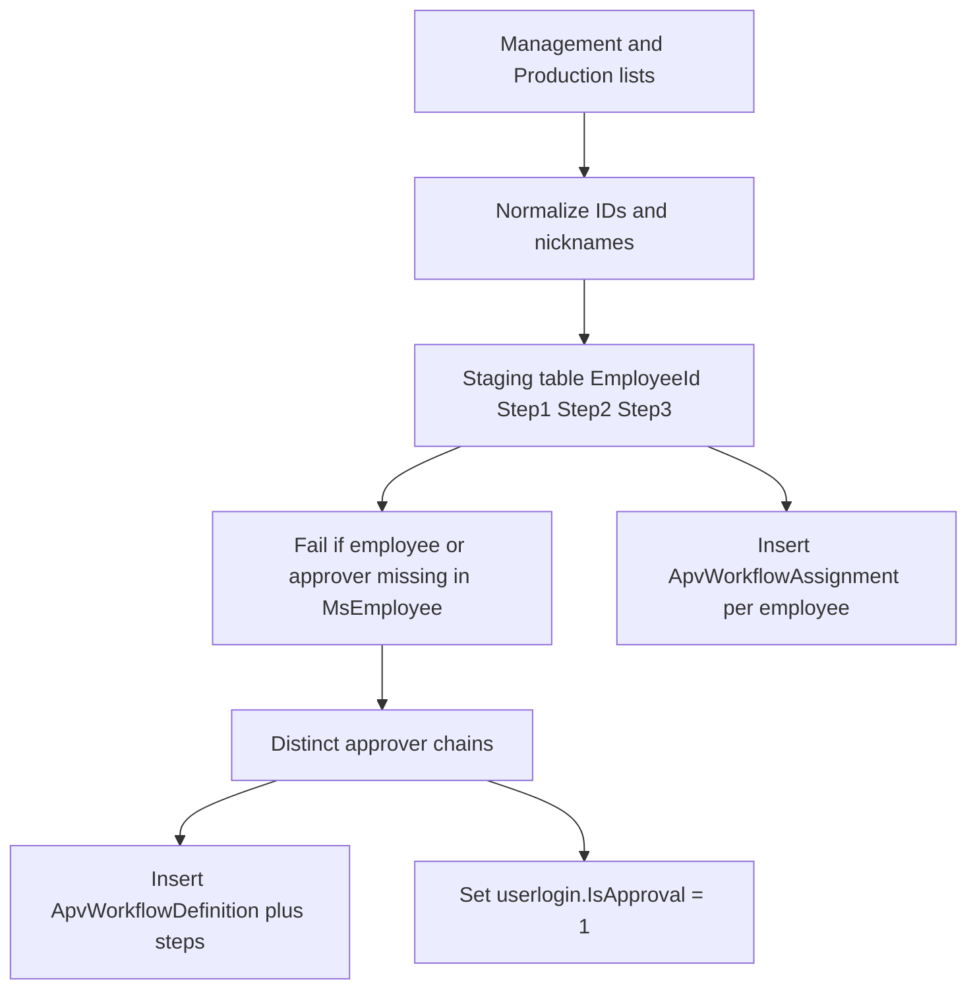

# One-off SQL seed for TC Leave/OT approval

## What we will import

Source of truth is the **per-employee** 1st / 2nd / 3rd approver columns in [WincomHRM/docs/approval/03_Management.md](WincomHRM/docs/approval/03_Management.md) and [WincomHRM/docs/approval/04_Production.md](WincomHRM/docs/approval/04_Production.md).

[WincomHRM/docs/approval/02_Approval_by_Dept.md](WincomHRM/docs/approval/02_Approval_by_Dept.md) is a **check list only** (section template). Do not drive inserts from it.

**Out of scope:** Accessibility / menu rights ([01_Accessibility.md](WincomHRM/docs/approval/01_Accessibility.md)), Claim / Allowance / Profile workflows, and the product Excel import in [plans/approval-workflow-excel-import.md](plans/approval-workflow-excel-import.md).

The customer model is “employee X is approved by A then B then C”. WincomHRM stores that as a **reusable workflow** (steps) plus an **employee assignment**. Leave and OT use the same chain, so the script duplicates the graph for `Module = 1` (Leave) and `Module = 2` (Overtime).



## How it maps onto existing tables

Use Specific User + Single-step (matches [ApprovalWorkflowMaintenanceService](WincomHRM_Classes/HelperClass/Approval/ApprovalWorkflowMaintenanceService.cs) rules):

| Customer field | WincomHRM |
| --- | --- |
| Unique (Step1, Step2, Step3) | One row in `ApvWorkflowDefinition` per module |
| Each non-blank step | `ApvStepDefinition`: `StepType = 1`, `ApproverSource = 3`, `SourceValue` = employee ID |
| Approver ID | `ApvStepDefinitionApprover.ApproverEmployeeId` |
| Requester Employee ID | `ApvWorkflowAssignment.EmployeeId` (dept/position left null) |
| Leave vs OT | Two copies: `Module` 1 and 2 |

Do **not** insert `ApvRequest` / `ApvStepInstance` / `ApvAction`.

Approvers must be flagged on login: column is `userlogin.IsApproval` ([UserLogin.cs](WincomHRM_Model/Model/Auth/UserLogin.cs) maps `IsApprover` → `IsApproval`). The resolver rejects Specific User IDs that are not approvers when the UI saves; at runtime Specific User still resolves from the step table, but inbox/login users need `IsApproval = 1`.

## Data fixes baked into the seed

IDs only after this map. Names in the sheets are ignored.

| Sheet value | Store as |
| --- | --- |
| PN HANEY / NORANI | `TCSB0388` |
| WANA / SOFI | `TCSB0465` |
| MR WINSTON | `TCSB9038` |
| MR ERIC | `TCSB9035` |
| MR XIE / XIE BILIN | `TCSB9011` |
| MR NG / NG CHUUN HOOE | `TCSB0533` |
| MR LEE | `TCSB0567` |
| MS PANG | `TCSB0566` |
| DONNA | `TCSB9028` |
| Glazing 1st approver `TCSB0030` (Nur Sarusi) | `TCSB0032` |
| `-` / blank | no step |

**Must confirm before run (script will RAISERROR if still wrong):**

- `TCSB0514` is both “Michelle / Purchasing HOD” (Management) and “Mohamad Syahril / Packing” (Production). One assignment per employee ID — resolve which person owns that ID in `MsEmployee`.
- Purchasing team 1st approver `TCSB0541 MICHELLE` is wrong (`TCSB0541` is Finance). Likely `TCSB0518` (Accessibility) or whoever `MsEmployee` says is Michelle.
- Self-approval kept as specified: `TCSB0541` and `TCSB0020` as their own step 1.

No default workflow. Employees not in the two lists (including CEO `TCSB9035` as requester) will hit “workflow not set up” until added. That is intentional for UAT.

## Script design

New file: [SQLTable/Migration/20260901_SeedTcApprovalWorkflow_LeaveOt.sql](SQLTable/Migration/20260901_SeedTcApprovalWorkflow_LeaveOt.sql)

Companion mapping notes: [WincomHRM/docs/approval/05_Import_Mapping.md](WincomHRM/docs/approval/05_Import_Mapping.md) (nickname table, known errors, how to re-run, verification queries).

Script layout:

1. **Parameters** at the top (same style as [SQLTable/Table/SampleAttendanceKpiWeek.txt](SQLTable/Table/SampleAttendanceKpiWeek.txt)):

```sql
DECLARE @CompanyCode NVARCHAR(5) = N'???';  -- SET ME
DECLARE @BranchCode  NVARCHAR(5) = N'???';
DECLARE @SeedBy      NVARCHAR(20) = N'TC-APV-SEED';
```

2. **Idempotent wipe** of previous seed only: delete `ApvWorkflowAssignment`, `ApvStepDefinitionApprover`, `ApvStepDefinition`, `ApvWorkflowDefinition` where `CompanyCode/BranchCode` match and `CreatedBy = @SeedBy`. Refuse to run if any `ApvRequest` is tied to those workflow IDs (in-flight requests).

3. **Staging** `#EmployeeApproval (EmployeeId, Step1, Step2, Step3, Section)` — ~200 `INSERT` rows transcribed from Management + Production after the ID map. One row per requester.

4. **Pre-flight** (abort with a result set, no inserts):
   - Duplicate `EmployeeId` in staging
   - Requester or any step ID not in `MsEmployee` for this company/branch
   - Blank `EmployeeId`
   - Same person as two different chains (the `TCSB0514` case)

5. **Build chains**: `DISTINCT Step1, Step2, Step3` → workflow name like `LEAVE | TCSB0200 > TCSB0533` (truncate to 100 chars). Loop modules `{1, 2}`. Insert header, then 1–3 steps in order, then approver row. Capture IDs via `OUTPUT` / table variable.

6. **Assignments**: one row per staging employee per module, `Priority = ROW_NUMBER()` (employee-specific rules, no catch-all). `IsActive = 1`.

7. **Approver flag**: `UPDATE userlogin SET IsApproval = 1` where `EmployeeID` is in the distinct step IDs and same company/branch. Report logins that do not exist (approver with no user account).

8. **Verification SELECTs**: chain counts, assignment counts per module, employees in `MsEmployee` with no assignment, workflows with zero steps.

Run in SSMS against the tenant DB (`WincomHRM_TC` locally). Set `@CompanyCode` / `@BranchCode` from `MsEmployee` first (`SELECT DISTINCT CompanyCode, BranchCode FROM MsEmployee`).

## After the script

Manual UAT in the app (no code change):

- Workflow Maintenance: unique chains present for Leave and Overtime
- Workflow Assignment: sample employees (Ball Milling team, a HOD with 1 step, Production Office Supervisor with 3 steps)
- Submit a test leave as a team employee; inbox shows step-1 approver
- Confirm a missing-list employee cannot submit

## Not doing

- No C# / Excel import page
- No department-scoped assignments (sections in the sheet are not `MsDepartment.DeptID`)
- No Accessibility / access-right import
