# Stock Transfer — Split to New Lot (TR V2)

## Goal

Add legacy-style **Split to New Lot** on [IvStockTransfer.razor](ErpWeb.UI/Inventory/Transactions/IvStockTransfer.razor): a **Split** button on each editable grid row for **lot-controlled** items. **Process** replaces that line with **N lines** (equal qty split; last line gets remainder), each with a distinct **`ToLotNo`**, same source pile, shared destination WH/loc from the dialog.

Confirmed behavior:
- **Qty:** equal split; last line absorbs rounding remainder
- **Lines:** replace original row (no parent/child model)

This is **lot transformation at destination** (`FromLotId` ≠ `ToLotId`), not v8 §14 same-lot move. Document as **TR V2** in [stock_transfer_implementation_plan_v8.md](ErpWeb/docs/stock_transfer_implementation_plan_v8.md) (new §16) — do not implement as a separate RS trx for this phase.

```mermaid
flowchart TB
  subgraph tx [Single DB transaction PostInventoryTRAsync]
    LockBatch[1 Lock batch NEW]
    Plan[2 Build line plans]
    LockSrc[3 Lock source piles]
    VerifySrc[4 Verify source qty identity UOM]
    CheckDestLot[5 LockLotExact dest ToLotNo must be absent]
    CreateLots[6 Insert dest IvLot rows staged]
    LockDst[7 FindOrCreateBalLoc dest piles]
    Mutate[8 Decrease source increase dest]
    Hist[9 Insert IvTrxHistory stamp details]
    Posted[10 BatchStatus POSTED]
    Save[11 SaveChangesAsync once]
    Commit[12 CommitAsync]
    LockBatch --> Plan --> LockSrc --> VerifySrc --> CheckDestLot --> CreateLots --> LockDst --> Mutate --> Hist --> Posted --> Save --> Commit
  end
  Fail[Any failure lot collision unique key hook] --> Rollback[RollbackAsync entire tx]
```



---

## Current gaps (must change)

| Layer | Today | Needed |
|-------|--------|--------|
| [IvStockTransferService.cs](ErpWeb.Core/Inventory/IvStockTransferService.cs) | Rejects `LotControl` and any `FrLotNo` | Allow lot source; require `ToLotNo` per line |
| `AddDetails` | `ToLotNo = string.Empty` | Persist `ToLotNo` from request |
| [BuildTrPostLineAsync](ErpWeb.Core/Inventory/IvInventoryPostingService.cs) | Rejects lots; `toSlice` uses empty lot | Source slice with `FrLotNo`; dest slice with `ToLotNo` |
| [PostInventoryTRAsync](ErpWeb.Core/Inventory/IvInventoryPostingService.cs) | `ToLotId = null`; no dest lot create | Create-only `IvLot` + `FindOrCreateBalLocAsync` with `LotId`; all inside existing `BeginTransactionAsync` |
| DTOs / VMs | No `ToLotNo` | Add to line request, DTO, VM, grid column |
| UI | Edit/Remove only | Split button + dialog; lot lines in add popup |

Non-lot TR V1 behavior stays unchanged (empty `ToLotNo`, empty dest lot in slice).

---

## Locked business rules (review resolutions)

These are **mandatory** — the coding agent must not choose alternatives.

### BR-1 — Lot-controlled line contract (MVP)

| Rule | Requirement |
|------|-------------|
| Source | `LotControl = true` → `FrLotNo` required; must match locked `IvBalLoc.LotNo` |
| Destination | `ToLotNo` required on **every** lot-controlled line (single or split) |
| New lot | `ToLotNo` must differ from `FrLotNo` (case-insensitive) |
| Same slice | Full `IvStockSliceKey` compare including dest `ToLotNo` |
| Split | Convenience UI only — generates N lines with distinct `ToLotNo`; not the only path |
| Manual single lot | **Allowed:** add/edit popup shows editable **Dest lot no** when `LotControl` (same validation as split-generated lots) |
| Non-lot | `FrLotNo` and `ToLotNo` must both be empty |
| Uniqueness | Within batch: `ToLotNo` unique per `ICode` using **trim + `StringComparer.OrdinalIgnoreCase`** (so `ABC001` and `abc001` are duplicates) |

### BR-2 — Existing destination lot = reject (never reuse)

TR destination lots are **create-only**. `FindOrCreateLotAsync` (MR semantics) must **not** be used for TR dest lots because it silently returns an existing `IvLot`.

**Four layers (defense in depth):**

1. **UI generator:** skip candidates in (a) current draft lines (case-insensitive), (b) `IvLot` for `(CompanyCode, ICode)`.
2. **Service save (see BR-6):** reject if `IvLot` exists unless same saved line with unchanged `ToLotNo`.
3. **Posting (authoritative):** `LockLotExactAsync` → if row exists, fail whole batch. Insert `IvLot` only when absent.
4. **Database (authoritative on race):** unique index **`UQ_IvLot_Company_ICode_LotNo`** already exists in [IvLotConfiguration.cs](ErpWeb.Model/Configurations/Inventory/IvLotConfiguration.cs). Posting must catch `DbUpdateException` unique violation on lot insert and return: `Destination lot '{ToLotNo}' already exists for item '{ICode}'.` — same message as pre-check failure.

**Not allowed:** reusing an existing lot to add qty to an existing dest pile via TR split.

### BR-3 — Lot number generation and collisions

**Format (Auto generate ON):**

- `prefix = DateTime.Today.ToString("yyMMdd")` (same as MR today)
- `Run no` = first 3-digit sequence to try (1 → `001`, 2 → `002`, …)
- Candidate: `prefix + seq.ToString("000")` e.g. `260901001`

**Auto generate OFF (manual first lot):**

- User enters **New lot no start** = full lot string for the **first** destination lot.
- Subsequent lots: if the string ends with a trailing digit run, **increment preserving width** of that run:
  - `LOT001` → `LOT002`, `LOT009` → `LOT010`, `LOT099` → `LOT100`, `LOT999` → `LOT1000`
- If no trailing digits: append `-2`, `-3`, … (`BASE-2`, `BASE-3`).
- If increment exhausts practical range → allocation **fail**.

**Constants (in `IvLotNumberGenerator`, not scattered):** `public const int AutoGenerateMaxSeq = 999;` (seq 001..999 inclusive when `autoGenerate=true`).

**Collision policy (skip forward):** skip document (case-insensitive) and DB collisions; fail only when seq &gt; `AutoGenerateMaxSeq` (auto) or suffix exhausted (manual). Example: DB has `260901001` + `260901003`, RunNo=1, N=3 → `260901002`, `260901004`, `260901005`.

**Helper (locked):**

```csharp
public static async Task<IReadOnlyList<string>> AllocateAsync(
    int count, string prefixOrFirstLot, int startSeq, bool autoGenerate,
    IReadOnlyCollection<string> usedInDocument,
    Func<string, Task<bool>> existsInDatabaseAsync);
```

### BR-4 — Single transaction boundary (mandatory)

`PostInventoryTRAsync` already uses `BeginTransactionAsync` + `CommitAsync` (same as MI/MR/TR V1). TR V2 **must keep** this pattern:

All of the following run **inside the same database transaction** for the batch:

- Destination `IvLot` creation (insert only)
- Source `IvBalLoc` decrease
- Destination `IvBalLoc` find/create + qty increase
- `IvTrxHistory` insert
- Detail FK stamps (`FromLotId`, `ToLotId`, `ToBalLocId`)
- Batch status → `POSTED`

**Any failure** (insufficient source qty, dest lot exists, unique-index race, hook throw, concurrency) → `RollbackAsync` on the transaction. **No partial state:**

- No new `IvLot` rows committed
- No dest `IvBalLoc` qty changes committed
- No source decrease committed
- No history rows committed
- Batch remains `NEW`

New `IvLot` rows are **not** committed until `SaveChangesAsync` + `CommitAsync` at end of post (same unit of work as balance/history). Prefer **one** `SaveChangesAsync` before `CommitAsync`, matching current TR.

### BR-8 — `DbUpdateException` on dest `IvLot` insert (mandatory)

When `SaveChangesAsync` raises `DbUpdateException` for `UQ_IvLot_Company_ICode_LotNo` (unique-index race after `LockLotExactAsync` returned null):

1. **Do not** continue processing the batch.
2. **Do not** rethrow raw `DbUpdateException`, SQLite, or SQL Server messages to the UI.
3. Call `await tx.RollbackAsync(cancellationToken)`.
4. Return `IvInventoryPostingBatchResult.Fail(batchNo, "Destination lot '{ToLotNo}' already exists for item '{ICode}'.")` — identical to pre-check failure text.

**Implementation (no agent choice):** BR-8 is **mandatory inside `PostInventoryTRAsync`**. The transaction owner owns rollback and business error conversion.

`PostInventoryTRAsync` must wrap its `SaveChangesAsync` (and `CommitAsync` if separate) in try/catch:

- On `DbUpdateException` when `IsUniqueViolation(ex)` and the failure is for a destination `IvLot` insert → `RollbackAsync` → return `Fail(...)` with the standard message above.
- **Do not** rely on `DispatchAsync` to perform rollback or convert this error. `DispatchAsync` outer catch is a safety net for unexpected failures only; TR lot unique violations must be handled and returned from `PostInventoryTRAsync` before the exception escapes.

Reuse existing `IsUniqueViolation(DbUpdateException)` in [IvInventoryPostingService.cs](ErpWeb.Core/Inventory/IvInventoryPostingService.cs).

**Test:** §9 partial-post atomicity + assert returned `ErrorMessage` is business text, not SQL.

### BR-5 — Equal split quantity (deterministic)

Use **`IvQty.Scale`** (currently `4` per [IvTrxConstants.cs](ErpWeb.Core/Inventory/IvTrxConstants.cs)) — do not hardcode a different precision:

```csharp
var scale = IvQty.Scale;
var baseQty = decimal.Floor(originQty / N * (decimal)Math.Pow(10, scale)) / (decimal)Math.Pow(10, scale);
// first N-1 lines = baseQty at scale
// last line = IvQty.Round(originQty - baseQty * (N - 1))
```

Example: origin `10.0000`, N=3 → `3.3333`, `3.3333`, `3.3334` (sums to origin at 4dp).

### BR-6 — Manual `ToLotNo` edit on saved lines

When validating save/update, compare trimmed case-insensitive:

| Scenario | Rule |
|----------|------|
| **New line** (no prior detail id / new `TrxLineNo`) | `ToLotNo` must **not** exist in `IvLot` for `(CompanyCode, ICode)` |
| **Existing line, `ToLotNo` unchanged** | Allow re-save (track via `OriginalToLotNo` on VM) |
| **Existing line, `ToLotNo` changed** | New value must **not** exist in `IvLot` |

Implementation: pass prior `ToLotNo` from loaded document into `ValidateLineAsync`.

### BR-7 — Split lines after Process (no parent/child)

After **Split.Process** completes, output lines are **normal independent** TR lines:

- No parent/child link or split group id.
- **No** enforced `sum(split) == original qty` in UI afterward.
- User may edit `ToLotNo`, qty, or delete lines freely; standard per-line + aggregate `FromBalLocId` validation applies.

---

## Phase LS-0 — Spec (doc only)

Append **§16 TR V2 — Lot split / new destination lots** to [stock_transfer_implementation_plan_v8.md](ErpWeb/docs/stock_transfer_implementation_plan_v8.md) containing **BR-1 through BR-8** verbatim.

Also note:

- **Post:** `SourceType = TR`, `SourceDocNo = batchNo`; `FromLotId` from locked source `IvBalLoc`; `ToLotId` from **newly created** dest lot only.
- **Out of scope:** UOM conversion, expiry on split, RS menu, same-lot WH move (v8 §14), reusing existing dest lots.

---

## Phase LS-1 — Core DTOs and document service

**Files:** [IIvStockTransferService.cs](ErpWeb.Core/Inventory/IIvStockTransferService.cs), [IvStockTransferService.cs](ErpWeb.Core/Inventory/IvStockTransferService.cs)

1. Add `ToLotNo` to `IvStockTransferLineRequest`, `IvStockTransferLineDto`, and `ValidatedLine` record.
2. **Remove** V1 hard rejects at lines ~695–698 and ~774–777; replace with:
   - **Lot item:** `FrLotNo` required and must match `IvBalLoc.LotNo`; `FromLotId` not staged (post only).
   - **Lot item:** `ToLotNo` required, non-empty, trimmed; must not equal `FrLotNo` (same slice guard already covers WH/loc/lot).
   - **Non-lot item:** `FrLotNo` and `ToLotNo` must be empty.
3. `AddDetails`: set `ToLotNo` from validated row (not `string.Empty` for lot lines).
4. **Batch validation** (in `ValidateLinesAsync` after per-line pass):
   - Unique `ToLotNo` per `ICode` within request (**trim + OrdinalIgnoreCase**).
   - **BR-6:** per-line existence rules for new / unchanged / changed `ToLotNo`.
   - `ToLotNo != FrLotNo` per line (case-insensitive).
   - Aggregate qty per `FromBalLocId` ≤ available (advisory at save; posting still authoritative).
5. `GetAsync` / list mapping: include `ToLotNo` on line DTOs.

---

## Phase LS-2 — Posting (TR lot split)

**File:** [IvInventoryPostingService.cs](ErpWeb.Core/Inventory/IvInventoryPostingService.cs)

### `BuildTrPostLineAsync`

Branch on `item.LotControl`:

| | Non-lot (V1) | Lot (V2) |
|---|-------------|----------|
| `FrLotNo` | must be `""` | required |
| `ToLotNo` | must be `""` | required |
| `fromSlice` | no lot | includes `FrLotNo` |
| `toSlice` | no lot | includes `ToLotNo` |
| Same-slice reject | full `IvStockSliceKey` | includes lot on both sides |

Extend `TrLinePlan` with `bool LotControl`, `string? ToLotNo`, `int? FromLotId` (filled at post), `int? ToLotId` (filled at post).

### `PostInventoryTRAsync` — BR-4 transaction + lock order + lot create

**Prerequisite:** existing `BeginTransactionAsync` / `CommitAsync` / `RollbackAsync` wrapper unchanged.

**Locked step order** (diagram and code must match; extend existing TR V1 flow, do not reorder source lock after dest create):

1. Lock batch (`NEW`), load details, history guard.
2. Build line plans (`BuildTrPostLineAsync`).
3. Aggregate decrease/increase maps (existing).
4. **Lock source piles** (`LockBalLocByIdForTenantAsync`), re-read identity + `StdUom`, verify aggregated source qty (existing TR V1).
5. **Dest lot pre-check (lot lines only):** for each distinct `(ICode, ToLotNo)`, `LockLotExactAsync` → if not null, rollback + fail (BR-2).
6. **Insert dest `IvLot` rows** (create-only, staged in `DbContext` — no commit).
7. **`FindOrCreateBalLocAsync`** for each ordered dest slice with `ToLotId`.
8. Apply source decreases + dest increases (existing).
9. Insert `IvTrxHistory`, stamp detail FKs, batch → `POSTED`.
10. **`SaveChangesAsync` once** inside try/catch — **BR-8** handles unique `IvLot` violation (rollback + `Fail`); do not rely on `DispatchAsync`.
11. **`CommitAsync`** on success only.

**Partial failure test target:** line 3 lot exists at step 5 or unique race at step 10 → nothing committed (§9).

Add `CreateLotAsync` to `IIvStockPostingRepository` if cleaner than inline insert; must not call `SaveChangesAsync` outside the posting transaction.

### `RollBackInventoryTRAsync`

Verify existing rollback handles distinct `ToBalLocId`/`ToLotId` per history row (should work if integrity check includes `ToLotNo`). Extend `ValidateTrHistoryIntegrity` if needed for lot FK pairing.

### Tests — [IvStockTransferPostingServiceTests.cs](ErpWeb.Tests/IvStockTransferPostingServiceTests.cs)

**Posting / rollback**

- Seed lot-controlled item + source `IvBalLoc` with `LotNo` + `LotId`.
- Save 3 lines, same `FromBalLocId`, different `ToLotNo`, equal split qty → post → source 0, 3 dest piles, 3 `IvLot` rows, 3 history rows.
- Rollback restores source qty once; dest lots remain in DB (lot master not deleted per inventory rules) but dest **qty** reversed — document expected behavior: rollback reverses `IvBalLoc` qty, history deleted; **`IvLot` rows may remain** (traceability). Align with MR rollback pattern.

**Validation**

- Reject: duplicate `ToLotNo` in batch (`ABC001` + `abc001`); `ToLotNo == FrLotNo`; non-lot item with `ToLotNo`.
- Reject save when `ToLotNo` exists (new line).
- Allow re-save unchanged `ToLotNo` on same line (NEW batch).
- Reject change `LOT-A` → `LOT-B` when `LOT-B` exists.

**§9 Partial-post atomicity (mandatory)**

Post 3 lot lines where lines 1–2 lots are free, line 3 `ToLotNo` **pre-seeded** in `IvLot`:

- Assert: post fails.
- Assert: source `StdQty` unchanged.
- Assert: **no** new dest `IvBalLoc` rows (or dest qty unchanged).
- Assert: **no** new `IvLot` rows from this post attempt (lines 1–2 lots not committed).
- Assert: `IvTrxHistory` count 0; batch `NEW`.
- Assert: failure message is business text (BR-8), not raw SQL/SQLite.

**§10 `IvLotNumberGenerator` unit tests** (new file `ErpWeb.Tests/IvLotNumberGeneratorTests.cs`):

| DB exists | Doc contains | RunNo | N | Expected |
|-----------|--------------|-------|---|----------|
| 260901001, 260901003 | — | 1 | 3 | 260901002, 260901004, 260901005 |
| 260901002 | 260901001 | 1 | 1 | 260901003 |
| 260901998, 260901999 | — | 998 | 2 | allocation failure |

Manual suffix: `LOT009` + 1 more → `LOT010`.

- Keep existing non-lot TR tests green.

---

## Phase LS-3 — UI

**Files:** [IvStockTransfer.razor](ErpWeb.UI/Inventory/Transactions/IvStockTransfer.razor), [IvStockTransfer.razor.cs](ErpWeb.UI/Inventory/Transactions/IvStockTransfer.razor.cs), optional [IvStockTransfer.razor.css](ErpWeb.UI/Inventory/Transactions/IvStockTransfer.razor.css)

### Grid

- Add **Split** icon button in command column (between Edit and Remove):
  - Visible when `CanEditDocument && line.LotControl && !string.IsNullOrWhiteSpace(line.FrLotNo) && line.Quantity > 0`
- Add **Dest lot** column: `ToLotNo` (or “—” for non-lot).

### Split dialog (`DxPopup`, match legacy fields)

| Field | Binding |
|-------|---------|
| Item code / description | read-only from source line |
| Origin qty | read-only `line.Quantity` |
| To warehouse / location | default from line; editable (re-validate via `OnWarehouseChangedAsync`) |
| Split to new record(s) | int N, min 2 |
| Auto generate | bool, default true |
| New lot no start | enabled when !auto |
| Run no | int, default 1 when auto |

**Process:**

1. Validate N ≥ 2, dest WH/loc, N ≤ reasonable cap (e.g. 99).
2. Compute equal split per **BR-5**.
3. Generate N lot numbers via `IvLotNumberGenerator.AllocateAsync` (BR-3).
4. Remove source line; append N lines. Set `OriginalToLotNo` for BR-6 tracking.
5. Renumber `LineNo`; `_isDirty = true`; close popup.

**After Process (BR-7):** lines are independent; no sum enforcement.

### Add/Edit line popup (lot items) — BR-1

- Stop clearing lot on select when `LotControl` (already partially wired via `Popup.LotControl`).
- Show read-only **source lot** (`FrLotNo`) from picker.
- Show editable **Dest lot no** (`ToLotNo`) when `LotControl` — required before OK (manual single-lot path).
- Optional **Generate** button: `AllocateAsync(count: 1, ...)`.
- Validate on OK per BR-1, BR-6; track `OriginalToLotNo` on VM.

### Save payload

Include `ToLotNo` in `IvStockTransferLineRequest` mapping (~line 487 in code-behind).

---

## Phase LS-4 — Regression

- `dotnet build` solution
- `dotnet test ErpWeb.Tests` — filter `IvStockTransfer|IvMiscIssue|IvMiscReceipt|IvInventoryPosting`
- Manual: create lot item MR receipt → TR from that pile → Split ×3 → save → post → verify 3 dest lots in DB

---

## Shared helper + optional lookup API

**`IvLotNumberGenerator.AllocateAsync`** — see BR-3 (constants `AutoGenerateMaxSeq = 999`).

**DB existence check:** `IIvInventoryLookupService.LotExistsAsync(company, iCode, lotNo)` for UI `AllocateAsync` skip logic.

**Locked comparison rule (no agent choice):**

- **Database lookup** (`LotExistsAsync`, posting `LockLotExactAsync`): **exact trimmed `LotNo` equality** — same as [IvStockPostingRepository.LockLotExactAsync](ErpWeb.Model/Repositories/Inventory/IvStockPostingRepository.cs) (`x.LotNo == lotNo` after trim). Do **not** add `ToUpper()`, `EF.Functions.Like`, or new collation behavior.
- **In-memory / batch validation** (duplicate `ToLotNo` within document, `FrLotNo` vs `ToLotNo`, `AllocateAsync` `usedInDocument`): **`StringComparer.OrdinalIgnoreCase`** after trim.

This matches how lots are stored and uniquely indexed (`UQ_IvLot_Company_ICode_LotNo`); UI generation should produce the canonical casing users expect, and DB checks use the staged string as entered.

MR refactor to `Allocate` is **optional** in this phase; TR split and manual Generate **required**.

---

## Risk notes

- **BR-4:** never commit `IvLot` / balance / history outside the TR post transaction.
- **Do not** use `FindOrCreateLotAsync` for TR destination lots (BR-2).
- **Do not** implement v8 §14 same-lot move in this work.
- **Rollback + IvLot:** posted lots remain in `IvLot` after rollback (by design); only qty/history reverse.
- **IvBalLoc picker:** ensure on-hand search returns lot piles.

---

## Review scorecard (addressed)

| Review item | Resolution |
|-------------|------------|
| Round 1 — Split vs manual | **BR-1** |
| Round 1 — Existing lot | **BR-2** + DB index + duplicate-key catch |
| Round 1 — Collision / Auto off | **BR-3** + `AutoGenerateMaxSeq` + suffix width |
| **1** Transaction boundary | **BR-4** |
| **2** Case-insensitive uniqueness | **BR-1** batch rule + `OrdinalIgnoreCase` |
| **3** DB uniqueness authoritative | `UQ_IvLot_Company_ICode_LotNo` + post catch |
| **4** Manual edit rules | **BR-6** + `OriginalToLotNo` |
| **5** Split unsaved state | **BR-7** |
| **6** IvQty scale | **BR-5** |
| **7** Manual increment algorithm | **BR-3** preserve suffix width |
| **8** Max seq in helper | `IvLotNumberGenerator.AutoGenerateMaxSeq = 999` |
| **9** Partial-post failure test | Tests §9 |
| **10** Generator collision tests | `IvLotNumberGeneratorTests` §10 |
| Round 3 — Unique violation handling | **BR-8** — handle only inside `PostInventoryTRAsync`, not `DispatchAsync` |
| Round 3 — Lock order diagram vs code | Posting steps 1–11 aligned with mermaid |
| Round 3 — `LotExistsAsync` comparison | Exact DB match; OrdinalIgnoreCase in-memory only |
