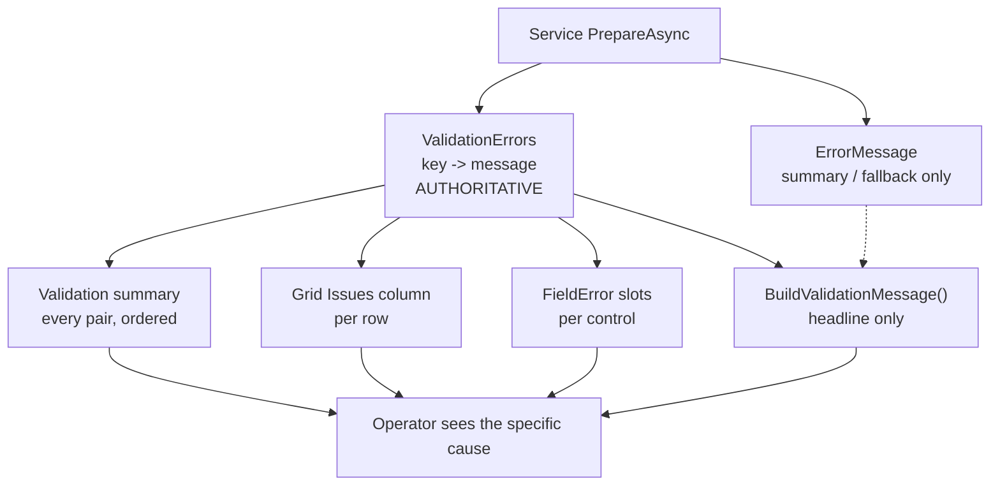

# Plan: Surface specific validation causes on all transaction entry pages

## Problem (verified)

Server sends the real reasons in `ValidationErrors` (field key → message); every page throws them away or hides them. `docs/purchase_cdn_logic.md` §8 and the repo notes ("Recurring bug pattern: validation-message masking") both call a generic "Validation failed." a **bug**.

The literal is produced by the **services**, not the pages:

- `SaInvoiceService.cs:506, 719` — `FailValidation("Validation failed.", readiness.ToValidationErrors())`
- `SaInvoiceService.cs:3355` — `PrepareOutcome.ToFail()`
- `PoInvoiceService.cs:1614` — `PrepareOutcome.Fail("Validation failed.", errors)`
- `PoOrderService.cs:58`, `PoPrService.cs:2070` — `ToFail()` → `Error ?? "Validation failed."`
- `PoCdnService.PreparedOutcome.ToFail()` (891-910) **already joins all messages** → the model to copy.

## Page audit (9 transaction entry pages, all inherit `PageBase`)

| Page | Validation branch | Detail shown | Notes |
|---|---|---|---|
| `SaInvoice.razor.cs` ~365 | generic | none | no `FieldError("Lines")` |
| `SaDo.razor.cs` ~1294 | generic | none | no `FieldError("Lines")` |
| `SaCdn.razor.cs` ~1041 | generic | none | no `FieldError("Lines")` |
| `SaSo.razor.cs` ~1136 | first-only | 1 of N | has it, `SaSo.razor:387` |
| `SaQt.razor.cs` ~1358 | first-only | 1 of N | has it, `SaQt.razor:455` |
| `PoOrder.razor.cs` ~1088 | first-only | 1 of N | has it, `PoOrder.razor:386` |
| `PoPr.razor.cs` ~860 | first-only | 1 of N | has it, `PoPr.razor:222` |
| `PoCdn.razor.cs` ~955 | generic | ALL (service joins) | has it, `PoCdn.razor:302` |
| `PoInvoice.razor.cs` ~299 | **NONE** | none | **no `ValidationErrors` member at all**; no `FieldError` fragment |

**Universal gap:** no page renders `Lines[n].<field>` keys. Key shape is `Lines[idx]` with idx **0-based** (`lineNo - 1`), so grid row = idx + 1.

## Precedent to copy

Master pages already ship the summary pattern (`ValidationErrors` → list): `IvStockMasterEntry.razor:335`, `SaCustEntry.razor:761`, `PoSuppEntry.razor:802` (`<section class="iv-card">` → `<h2>Validation</h2>` → `<ul class="iv-validation-list">Key: Value`). Transaction pages use `sdoc-` chrome, not `iv-` chrome.

Reusable `sdoc-` primitives already exist in `SaDocPage.razor.css`: `sdoc-toast`, `sdoc-toast--err`, `sdoc-toast__body`, `sdoc-toast__close`, `sdoc-warn-list`, `sdoc-field-error`. No new CSS expected. No `sdoc-banner` exists.

## Contract (authoritative source)

**`ValidationErrors` is the authoritative structured validation data.** `ErrorMessage` is a derived convenience/fallback summary and must never be the only source the UI reads. Making this explicit is what stops the masking bug from returning.

### Ordering rule (deterministic, mandatory)

Every surface — headline, panel, grid column — renders in the **same** order, and never relies on dictionary enumeration order:

1. Document-level keys first (any key not matching `Lines[n]…`), sorted alphabetically by key.
2. Then line keys, ordered by line index ascending, then by field name.

So the operator reads document problems, then line 1, line 2, line 3 …

### De-duplication rule (mandatory)

**No de-duplication may remove a row-scoped message.** Two different rows can legitimately carry identical text — e.g. `Lines[0].TaxGrCode` and `Lines[1].TaxGrCode` both resolve to `"Tax group 'SR' was not found."`. The headline therefore composes `ValidationFieldLabel(key) — message` per entry and joins those, which keeps rows distinguishable; the panel renders every key/value pair unconditionally. Only exact duplicates of the *composed* string are collapsed, and a dictionary cannot produce those.

## Steps

### Phase 1 — shared plumbing (blocks Phase 3)

1. New pure class `ErpWeb.Core/Services/ValidationMessageFormat.cs` — no EF, no UI, so it is unit-testable (`ErpWeb.Tests` cannot see `ErpWeb.UI`; see Decisions). Four members:
   - `Order(IEnumerable<KeyValuePair<string,string>> errors)` — the **single** ordering definition implementing **Contract → Ordering rule**. Consumed by the headline, the panel, and the grid column so all three can never disagree.
   - `BuildHeadline(IReadOnlyDictionary<string,string> errors, string? serverMessage)` — a **convenience headline only**. Orders via `Order`, composes `Label(key) — message` per entry, joins with a space, falls back to `serverMessage`, then to `"Validation failed."` only if **both** the dictionary and `serverMessage` are empty. **No de-duplication of raw messages** (see **Contract → De-duplication rule**) and it may never reduce or replace the dictionary.
   - `LineMessages(errors, lineNo)` — every value for keys starting `Lines[{lineNo - 1}]`, in `Order` order, as a list. Never collapses multiples.
   - `Label(string key)` — **mandatory, not optional**. Friendly label for known keys (`SellingGlCode` -> "Sales GL", `ArGlCode` -> "Customer AR GL", `TaxGlCode` -> "Tax GL", `Qty` -> "Quantity", `FrWarehouse` -> "Warehouse", …), else the raw key verbatim. Rewrites the `Lines[n].X` shape to `Line {n+1} — X` and the bare `Lines` key to `Lines`.
2. `ErpWeb.UI/Components/Pages/PageBase.cs`: add four thin `protected static` wrappers (`OrderValidationErrors`, `BuildValidationMessage`, `LineErrorMessages`, `ValidationFieldLabel`) delegating to that class, so pages keep the short call sites. All 9 pages inherit `PageBase`.
3. New `ErpWeb.UI/Sales/Transactions/SdValidationSummary.razor` (+ `.razor.cs` if needed). Renders nothing when `Errors` is empty **and** `Message` is blank; otherwise the message as the headline plus **every** entry in a `sdoc-warn-list`, iterated in `OrderValidationErrors` order and **never filtered or de-duplicated**. Each row shows the friendly label from `ValidationFieldLabel(key)` with the raw key reachable per Further Consideration 1, then the message. Parameters: `Errors`, `Message`, `OnDismiss` (EventCallback). That folder is correct because **both** `ErpWeb.UI/Sales/_Imports.razor:10` and `ErpWeb.UI/Purchase/_Imports.razor:12` already `@using ErpWeb.UI.Sales.Transactions` — the same reason `SaDocPage` is usable in purchase pages.

### Phase 2 — server contract hardening (parallel with Phase 3)

4. Replace the literal in the 5 offending services so the message contract holds even if a page regresses: `SaInvoiceService` (506, 719, 3355), `PoInvoiceService` (1614), `PoOrderService` (58, 609, 1074), `PoPrService` (407, 655, 2070). Copy the `PoCdnService.PreparedOutcome.ToFail()` join idiom; `SaInvoiceService` already has `CommercialReadinessResult.JoinedMessage()` (~3069) to reuse. The joined text is a **fallback/summary only** — the dictionary stays the authoritative payload. Leave `PoCdnService` alone — already correct.

### Phase 3 — page wiring (depends on Phase 1; the 9 pages are independent of each other)

5. Generic-message pages — `SaInvoice`, `SaDo`, `SaCdn`, `PoCdn`: in the `Validation` case assign `ValidationErrors`, then `ErrorMessage = BuildValidationMessage(ValidationErrors, result.ErrorMessage)`.
6. First-only pages — `SaSo`, `SaQt`, `PoOrder`, `PoPr`: delete the `firstDetail` block and call `BuildValidationMessage(...)` so **all** messages show, not one.
7. `PoInvoice` (worst case): add the missing `ValidationErrors` dictionary member; clear it in `SaveAsync`; branch on `PoInvoiceErrorKind.Validation` to capture the dictionary and use `BuildValidationMessage`; other kinds keep their existing messages.
8. All 9 `.razor` files: replace the inline `sdoc-toast--err` block with the `SdValidationSummary` component (one line), passing `ValidationErrors`, `ErrorMessage`, `DismissError`.
9. All 9 grids: add an "Issues" `DxGridDataColumn` whose `CellDisplayTemplate` renders `LineErrorMessages(ValidationErrors, row.Line)`. This removes the `Lines[n]` blind spot. Required behaviour:
   - **Every** error for the row is rendered, one `sdoc-field-error` line each — never the first only, never silently truncated.
   - A row with no errors renders an empty cell, no placeholder text.
   - The column stays compact: cap the visible lines (e.g. 2) and expose the remainder as `+N more` with a `title` tooltip listing all of them, so a row with many errors cannot blow out the grid height.
   - Row mapping is `Lines[n]` -> displayed row `n + 1`, taken from the VM's own `Line` property (already renumbered 1..N by `Renumber()`), **not** the grid's row index, so a filtered or re-ordered grid cannot mis-attribute an error.
10. Pages missing `@FieldError("Lines")` (`SaInvoice`, `SaDo`, `SaCdn`, `PoInvoice`): add the slot for document-level line errors ("Add at least one line.", the SO/DO mix ban, over-allocation). Cosmetic once step 8 lands, but keeps errors next to the control.

### Phase 4 — verification

11. Tests pinning the contract: in each of the 9 service test files (`SaInvoiceServiceTests`, `SaDoServiceTests`, `SaCdnServiceTests`, `SaSoServiceTests`, `SaQtServiceTests`, `PoOrderServiceTests`, `PoPrServiceTests`, `PoCdnServiceTests`, `PoInvoiceServiceTests`) assert that an `ErrorKind.Validation` result has an `ErrorMessage` that is **not** the literal `"Validation failed."` and **contains** the specific expected text. Extend existing assertions rather than adding new fixtures — `SaInvoiceServiceTests.cs:542-546` already asserts the `ValidationErrors` keys.
12. **Multi-line regression test (new, required).** Seed a document where line 1 and line 2 carry the *same* message text and line 3 carries a different one (e.g. two lines with a missing Sales GL, one with a missing tax group). Assert:
    - every error key survives in `ValidationErrors` — nothing collapsed by de-duplication;
    - the two identical-text errors on `Lines[0]` and `Lines[1]` are both present and separately keyed;
    - `ErrorMessage`/`BuildValidationMessage` contains all three, not one;
    - `LineErrorMessages(errors, 2)` returns only row 2's message, never row 1's;
    - the grid column for row 2 shows row 2's messages and row 1 shows row 1's.
    This is the direct regression guard for the `Lines[n]` gap.
13. Pure-helper tests in a new `ErpWeb.Tests/ValidationMessageFormatTests.cs`: ordering (document-level before lines, lines ascending), `Label` for known and unknown keys including the `Lines[n].X` rewrite, `BuildHeadline` fallback chain, and the de-duplication rule (two rows with identical text both appear).
14. `dotnet build ErpWeb.slnx --nologo -v:q` — **MANDATORY**: `ErpWeb.Tests` has no reference to `ErpWeb.UI`, so `dotnet test` never compiles razor changes (repo note; this cost a run before).
15. `dotnet test ErpWeb.Tests/ErpWeb.Tests.csproj`.
16. Manual smoke: reproduce the reported SO → invoice failure and confirm the toast names the actual field instead of `"Validation failed."`; repeat on one purchase page (`PoInvoice`) and one master page to confirm no regression.

## Relevant files

**Foundation**
- `ErpWeb.Core/Services/ValidationMessageFormat.cs` — NEW pure class (ordering, headline, labels, per-line messages); testable from `ErpWeb.Tests`.
- `ErpWeb.UI/Components/Pages/PageBase.cs` — add the 4 thin wrappers; all 9 pages inherit it.
- `ErpWeb.UI/Sales/Transactions/SdValidationSummary.razor` — NEW, shared by sales + purchase.
- `ErpWeb.UI/Sales/Transactions/SaDocPage.razor.css` — only if the summary overflows; the `sdoc-toast` / `sdoc-warn-list` / `sdoc-field-error` primitives already exist.

**Pages** (`.razor` + `.razor.cs` each)
- `ErpWeb.UI/Sales/Transactions/`: `SaInvoice`, `SaDo`, `SaCdn`, `SaSo`, `SaQt`
- `ErpWeb.UI/Purchase/Transactions/`: `PoOrder`, `PoPr`, `PoCdn`, `PoInvoice`

**Services**
- `ErpWeb.Core/Sales/SaInvoiceService.cs` (506, 719, 3355)
- `ErpWeb.Core/Purchase/PoOrderService.cs` (58, 609, 1074), `PoPrService.cs` (407, 655, 2070), `PoInvoiceService.cs` (1614)
- `ErpWeb.Core/Purchase/PoCdnService.cs` (891-910) — the reference implementation, do not change.

**Tests**
- `ErpWeb.Tests/ValidationMessageFormatTests.cs` — NEW; pure helper coverage (ordering, labels, headline fallback, de-duplication rule).
- `ErpWeb.Tests/{SaInvoice,SaDo,SaCdn,SaSo,SaQt,PoOrder,PoPr,PoCdn,PoInvoice}ServiceTests.cs` — extend with the "never the literal" contract assertion and the multi-line regression.

**Reference / do not change**
- `ErpWeb.UI/Inventory/Masters/IvStockMasterEntry.razor:335`, `ErpWeb.UI/Sales/Masters/SaCustEntry.razor:761` — the master-page summary precedent.
- `docs/purchase_cdn_logic.md` §8 — the written rule ("a generic Validation failed. is a bug").

## Verification

### Build

1. `dotnet build ErpWeb.slnx --nologo -v:q` -> **0 errors**. Compiles the razor changes that `dotnet test` cannot see.

### Tests

2. `dotnet test ErpWeb.Tests/ErpWeb.Tests.csproj` -> no new failures.
3. Pure helper tests green (ordering, labels, headline fallback, de-duplication rule).

### Validation contract (per affected service)

4. An `ErrorKind.Validation` result carries a populated `ValidationErrors` when specific errors exist.
5. Its `ErrorMessage` is **not** merely `"Validation failed."`.
6. The dictionary still holds **every** expected key — the joined headline did not consume or replace it.

### UI

7. The validation summary displays **all** errors, not the first.
8. Two rows with identical message text both appear, correctly labelled (row 1 and row 2).
9. Line numbers are correct: `Lines[0]` renders as "Line 1", `Lines[1]` as "Line 2".
10. The grid Issues column points at the correct row and shows every error for that row.
11. Existing field-level `FieldError` slots still work.
12. No validation error is silently discarded on any of the three surfaces.

### Non-validation failures

13. Concurrency, NotFound, Authorization and other kinds still display their existing specific messages and do **not** render an empty validation panel.

### Manual scenarios

14. SO -> Invoice with an item lacking `IvStockMaster.SellingGLCode`.
15. Customer with a missing `SaCust.GlCode` (`ArGlCode`).
16. `PoInvoice` line whose item lacks `IvStockMaster.PurchaseGLCode`.
17. Multiple invalid lines in one document (the de-duplication case).
18. A non-validation failure.

## Decisions

- Root fix is placed in the **pages** (dictionary captured, message promoted, panel renders all) **and** the **services** (join the message) — belt and braces, because the repo notes record this exact masking bug recurring twice already.
- Scope: the 9 transaction entry pages (5 sales + 4 purchase). Master pages already render their summary and are OUT of scope. List pages and pickers are OUT of scope (no document validation).
- Reuse `sdoc-` classes and the existing master-page UX shape rather than inventing a new panel style; no new permission, route, menu, or DB script is needed (this is presentation + message text).
- `PoCdnService` is the reference and is not modified.
- No schema, DTO, or API-shape change: `ValidationErrors` already exists on all 9 result types — `PoInvoiceOperationResult` **has** it (`IPoInvoiceService.cs:41`); only the page lacks a member.
- **`ValidationErrors` is the authoritative validation data; `ErrorMessage` is a derived summary/fallback only.** Every UI surface reads the dictionary. `BuildValidationMessage` may never replace, reduce, or de-duplicate the dictionary, and no surface may read `ErrorMessage` alone. (Review item 2.1.)
- **`ValidationFieldLabel` is mandatory, not optional.** The operator reads "Line 1 — Sales GL", never `Lines[0].SellingGlCode`; unknown keys fall back to the raw key so nothing is ever unlabelled. (Review item 2.3.)
- **Display order is deterministic and shared.** Document-level errors first, then line 1, 2, 3 …; the headline, the panel, and the grid column all use the one `OrderValidationErrors` definition so they can never disagree. (Review item 2.4.)
- **No de-duplication of raw messages.** Identical text on two different rows is two distinct errors and both are shown; only the composed `label — message` string may be collapsed, which a dictionary cannot duplicate. (Review item 2.2.)
- **Pure helpers live in `ErpWeb.Core`, not `ErpWeb.UI`.** `ErpWeb.Tests` does not reference `ErpWeb.UI` (repo note), so helpers placed in the UI project would be untestable; `PageBase` keeps thin wrappers for ergonomic call sites.

## Further Considerations

1. **Raw keys vs friendly labels — RESOLVED by review: labels are mandatory.** `ValidationFieldLabel` is now a required Phase 1 deliverable (see Decisions). The only remaining sub-choice is how the raw key stays reachable for support: **Option A** label only; **Option B** label plus the raw key in a `title` tooltip; **Option C** label plus the raw key inline in small muted text. **Recommend B** — unobtrusive for the operator, still there for support and for grepping the server key.
2. **Where the summary lives.**
   - Option A: inline panel above the footer, replacing the error toast (matches the master pages, survives a long list).
   - Option B: keep the toast and add the list inside it.
   - Option C: both — specific headline in the toast, full list in the panel.
   - **Recommend C**, falling back to A if the toast handles long text badly.
3. **Should the grid "Issues" column ship in this pass (step 9) or as a follow-on?** It is 9 similar edits and is what makes `Lines[n]` errors point at a row. **Recommend including it**; leave it out only if the change must stay minimal, in which case the summary panel still names the row.
4. **Optional wider sweep:** the same "generic message" literal also exists in `IvInventoryRefService.cs:121`, `MsRefService.cs:124`, `AdSmNumAdminService.cs:111`, `PoMasterRefService.cs:427`, several `SaSalesRefService` methods. Those are **master** services whose pages already render the dictionary, so user impact is lower. **Recommend a follow-up pass**, not this one.

## As built (2026-09-17)

Implemented and verified: solution builds with **0 compiler errors**; `dotnet test ErpWeb.Tests` **1455 passed / 0 failed / 0 skipped** (was 1423; +32 new).

**Deviations and findings worth keeping:**

1. **A raw join broke a documented contract — caught by tests.** `SaSoServiceTests.Invoice_LinkDo_posts_DO_INV_and_rejects_mix_with_SO_INV` and `SaDocApplicationTests.Add_item_plus_standalone_DO_allowed_and_duplicate_DoLine_rejected` assert `ErrorMessage == SaDocAllocationReasonCodes.MixForbidden`, i.e. the reason code IS the payload for that path. Joining the dictionary destroyed it. Fix: a 5th helper `ValidationMessageFormat.ResolveServiceMessage(errors, message)` — a caller-supplied specific message always wins; only the literal `"Validation failed."` (or nothing) is replaced by the concrete causes. Every `ToFail()` now uses it. **Any future "helpful" message rewrite must check for reason-code payloads first.**
2. **Server message = raw join; labels are a display concern.** `JoinMessages` deliberately emits unlabelled text (`"Tax group 'X' was not found."`) so the service layer has no UI vocabulary. Row labels (`"Line 1 — Tax group: …"`) are applied by `BuildHeadline` (page) and by the panel. Consequence: a consumer reading only `ErrorMessage` still cannot distinguish two rows with identical text — deliberate, because the dictionary is the authoritative payload. Pinned by the multi-line test, which asserts the labelled form via `BuildHeadline`.
3. **Within-row ordering is alphabetical by field name** (`Lines[1].ICode` before `Lines[1].Qty`), per the Ordering rule's tie-break. Two test expectations had to be corrected to match.
4. **Grid Issues column maps by collection position, not by a `Line` property.** `PoInvoice`'s `LineEdit` has no `Line` member, so all 9 grids use `Lines.IndexOf(row) + 1` (`EditLines` for `PoInvoice`). That is exactly the server's `Lines[index]` convention, so it cannot mis-attribute even if a VM's `Line` were stale. Cost is O(n) per cell; irrelevant at document sizes.
5. **Plan step 10 (`@FieldError("Lines")` slots) was NOT done** — redundant once the summary lists every key (including `Lines`) with a label, and it would have meant layout churn in 4 razor files for no new information.
6. **Further Consideration 2 was resolved as "replace the toast", not "toast + footer panel".** `SdValidationSummary` renders the headline plus the complete ordered list in one place, matching the normative steps and the existing `PostWarnings` precedent. The footer-adjacent second panel remains an optional follow-up for long forms where the toast scrolls out of view.
7. `ErpWeb` (the running app) locks its output DLLs, so a full-solution build reports `MSB3027`/`MSB3021` copy errors while the app is running. These are not compiler errors — check for `error CS` to confirm. Stop the app to get a clean build.
