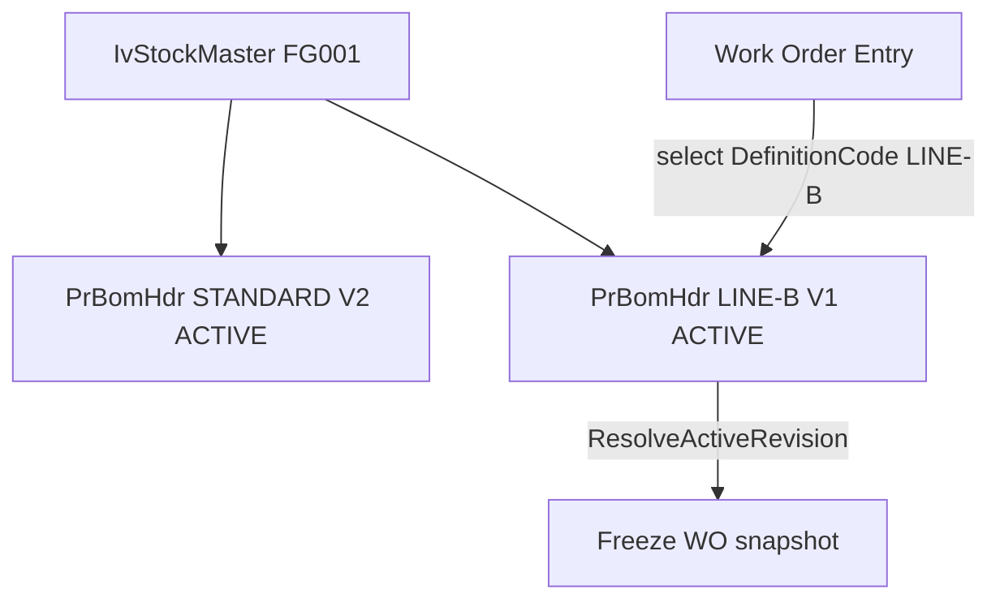

# Multiple Product Definitions + Work Order Definition Selection

## Locked decisions

- Keep `PrBomHdr` as the definition+revision table (no separate definition master).
- Identity: `(CompanyCode, ProdCode, DefinitionCode, Version)`; only one ACTIVE per definition; one ACTIVE default per product.
- Work Order selects `DefinitionCode`; service resolves ACTIVE revision; freeze exact revision UIDs (keep both `SourceBomHdrId` and `SourceProductDefinitionRevisionId`).
- Multi-level follow uses `SupplySource` + `ComponentDefinitionCode`, not MfgType alone.
- Single WO snapshot engine: `WorkOrderSnapshotBuilder` for Preview/Create/Refresh/Change Definition; retire `BomExplosion`/`PreparedSnapshot` WO save path.
- Versions: snapshot format **3**, snapshot hash **2**, definition source hash **2**.
- No new unit tests; compile-fix existing tests only if public signatures break; verify with build + manual scenarios.
- Drop `EffectiveFrom`/`EffectiveTo`/`SnapshotAsOfDate`/`SourceEffectiveFrom` only after app cutover works (Phase 7).

## Current state (validated)

- `PrBomHdr` unique on `(CompanyCode, ProdCode, Version)`; activation via overlapping `EffectiveFrom`/`EffectiveTo`.
- No `DefinitionCode` / `ComponentDefinitionCode` anywhere.
- WO resolves via `ProductDefinitionSnapshotLoader.ResolveRevisionAsync(company, product, date)`.
- Dual engines: v2 `WorkOrderSnapshotBuilder` vs legacy `BomExplosion`/`SaveDraftAsync`.
- Format Current=2; hash versions=1.

## Phase 1 — Schema + domain identity

**New script:** [scripts/alter-product-definition-multiple-definitions.sql](scripts/alter-product-definition-multiple-definitions.sql)

Staged migration (fail-fast report before mutate):

1. Add nullable `PrBomHdr.DefinitionCode/Name/IsDefaultDefinition`; backfill `STANDARD` / `Standard Production`; collapse multi-ACTIVE per product to highest Version; mark retained ACTIVE as default; then NOT NULL.
2. Replace `UQ_PrBomHdr_Company_Prod_Version` with `UQ_PrBomHdr_Company_Prod_Definition_Version`; add filtered uniques `UX_PrBomHdr_OneActiveRevision` and `UX_PrBomHdr_OneActiveDefault`; lookup index; blank `DefinitionCode` check; Status default DRAFT for greenfield.
3. Add `PrDefBOM.ComponentDefinitionCode`; backfill SEPARATE lines from component default ACTIVE (else report).
4. Add `PrWorkOrder.SourceDefinitionCode/Name` + `PrWorkOrderMaterial.ComponentDefinitionCode`; backfill via SourceBomHdrID / SourceBomLineID.
5. Do **not** drop date columns yet.

**Update greenfield scripts:** [scripts/create-prdefbom.sql](scripts/create-prdefbom.sql), [scripts/alter-prdefbom-multilevel.sql](scripts/alter-prdefbom-multilevel.sql), [scripts/create-production-workorder.sql](scripts/create-production-workorder.sql), [scripts/deploy-product-definition-phase1.sql](scripts/deploy-product-definition-phase1.sql). Route legacy backfill in [scripts/create-product-definition-routing.sql](scripts/create-product-definition-routing.sql) to STANDARD only.

**EF entities/configs:**
- [ErpWeb.Model/Entities/Planning/PrBomHdr.cs](ErpWeb.Model/Entities/Planning/PrBomHdr.cs) + [PrBomHdrConfiguration.cs](ErpWeb.Model/Configurations/Planning/PrBomHdrConfiguration.cs)
- [PrDefBOM.cs](ErpWeb.Model/Entities/Planning/PrDefBOM.cs) + [PrDefBomConfiguration.cs](ErpWeb.Model/Configurations/Planning/PrDefBomConfiguration.cs)
- [ProductionWorkOrder.cs](ErpWeb.Model/Entities/Production/ProductionWorkOrder.cs) + config; material entity/config/VM

Add new columns; keep date properties until Phase 7 cleanup.

## Phase 2 — Product Definition service

[IPrProductDefService.cs](ErpWeb.Core/Planning/IPrProductDefService.cs) / [PrProductDefService.cs](ErpWeb.Core/Planning/PrProductDefService.cs)

- List groups by `ProdCode + DefinitionCode`; expose ActiveVersion separately from latest.
- Identity methods take `definitionCode`: `GetAsync`, `GetStructureTreeAsync`, `CreateNewVersionAsync`, `ActivateAsync`.
- Delete uses `PrProductDefinitionKey { ProdCode, DefinitionCode }` — block only on that definition’s revision UIDs / BOM refs / SEPARATE parent lines.
- New: `ListActiveDefinitionsAsync` → `PrProductDefinitionLookupRow`.
- Activation: replace `FindOverlapAsync` / `WindowsOverlap` / `SupersedeOverlappingAsync` with `SupersedeActiveRevisionAsync(company, prod, definition, keepUid)`.
- Default: first ACTIVE for product becomes default; activating a default clears other ACTIVE defaults.
- New definition: Product+DefinitionCode must be new; Version starts at 1; DefinitionCode immutable after first save.
- BOM line VM + validation: `ComponentDefinitionCode` required iff `SEPARATE_PRODUCT_DEFINITION`; null otherwise; ACTIVE must exist for component+code.

## Phase 3 — Product Definition UI

- [PrProductDefEntry.razor](ErpWeb.UI/Planning/Masters/PrProductDefEntry.razor)(+.cs): Definition Code/Name/Default; remove Effective From/To; routes `/view|edit/{ProdCode}/{DefinitionCode}`; old `/{ProdCode}` redirects to default (or choice if ambiguous).
- Materials tab: Component Production Definition picker when SupplySource = SEPARATE.
- [PrProductDefList.razor](ErpWeb.UI/Planning/Masters/PrProductDefList.razor)(+.cs): one row per definition; actions pass both keys.
- Update help text (definition vs revision vs default).

## Phase 4 — Structure tree / circular BOM / Explorer

- Structure cache keys → `(Prod, DefinitionCode, Version)`; remove product-only `LatestResolved`.
- Recursion: SEPARATE → child `ICode + ComponentDefinitionCode`; INTERNAL_ROUTE_WIP / PURCHASED / EXTERNAL_SUPPLY → no child def load.
- [CircularBomValidator.cs](ErpWeb.Core/Planning/CircularBomValidator.cs): graph key `(ProdCode, DefinitionCode)`; cycle messages include both.
- [BomExplosionService.cs](ErpWeb.Core/Planning/BomExplosionService.cs) + [PrBomExplorer](ErpWeb.UI/Planning/Masters/PrBomExplorer.razor): remove As-of date; resolve ACTIVE by Product+DefinitionCode; optional Version for draft/history preview.

## Phase 5 — Work Order snapshot engine

- [ProductDefinitionSnapshotLoader.cs](ErpWeb.Core/Production/ProductDefinitionSnapshotLoader.cs): `ResolveActiveRevisionAsync(company, product, definitionCode)`; keep `LoadRevisionAsync`.
- [WorkOrderSnapshotBuilder.cs](ErpWeb.Core/Production/WorkOrderSnapshotBuilder.cs): request `DefinitionCode` not date; stamp `SourceDefinitionCode/Name` + material `ComponentDefinitionCode`.
- Hashers / [ProductionDomainConstants.cs](ErpWeb.Model/Entities/Production/ProductionDomainConstants.cs): format 3; snapshot hash 2 (add SourceDefinitionCode + SourceProductDefinitionRevisionId + material ComponentDefinitionCode; remove date fields); source hash 2 (add DefinitionCode; remove Effective*; exclude IsDefaultDefinition from manufacturing hash).
- [ProductionWorkOrderService](ErpWeb.Core/Production/ProductionWorkOrderService.DraftCommands.cs): require DefinitionCode; Refresh stays on same DefinitionCode → current ACTIVE; deprecate/remove WO `BuildSnapshotAsync`/`PreparedSnapshot` path.
- Material substitute: copy replacement `ComponentDefinitionCode` from frozen source line.
- Readiness: do not require source still ACTIVE at release.

## Phase 6 — Work Order UI

- [PrWorkOrderEntry.razor](ErpWeb.UI/Planning/WorkOrders/PrWorkOrderEntry.razor)(+.cs): replace BOM as-of with Production Definition dropdown; auto-select default/only; show resolved revision; InputFingerprint uses DefinitionCode.
- Saved overview: Definition Code/Name/Revision; remove snapshot date; hero chip `LINE-B · V2`.
- [PrWorkOrderList](ErpWeb.UI/Planning/WorkOrders/PrWorkOrderList.razor): Definition column (+ optional filter).
- Draft **Change Definition**: preview diff → confirm → rebuild snapshot, reset overrides, recalculate schedule, `SnapshotRevision++`, audit `DEFINITION_CHANGED`. Released: locked.
- Update How To Use help.

## Phase 7 — Cleanup

- After manual scenarios pass: drop `PrBomHdr.EffectiveFrom/To`, `PrWorkOrder.SnapshotAsOfDate`/`SourceEffectiveFrom` in same alter script Stage E (or follow-up run); remove EF mappings and dead helpers.
- Out of scope: `PrDefImportService` redesign (legacy tables only).

## Verification

Build: `ErpWeb.Model`, `ErpWeb.Core`, `ErpWeb.UI`, `ErpWeb` (minimal test compile fixes only).

Manual: Scenarios 1–13 from the spec (multi ACTIVE defs, WO freeze, refresh same def, change definition, SEPARATE/INTERNAL child, circular graph, exact delete, no date UI).